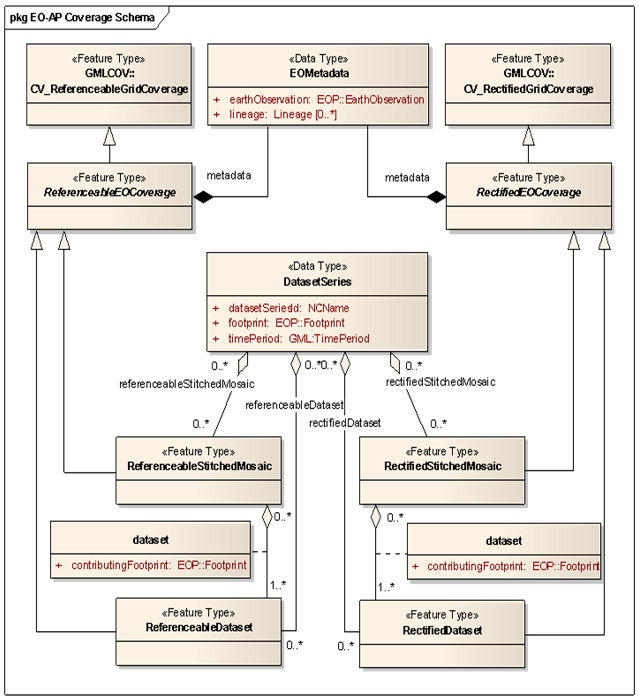
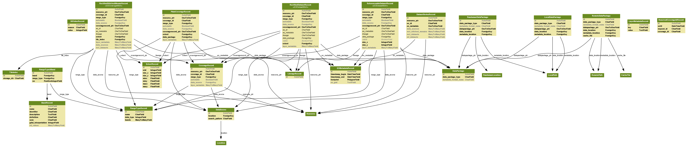
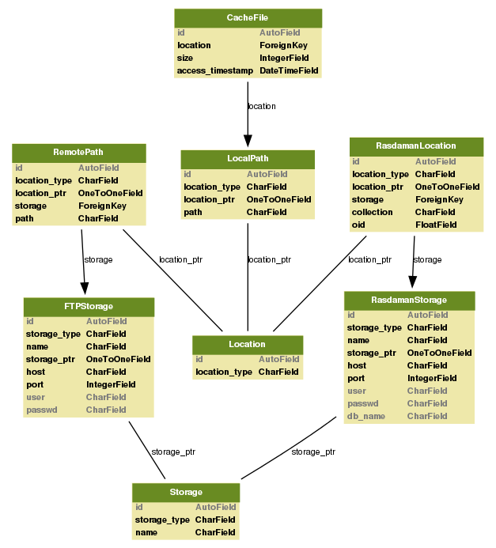

.. Data Model Overview

Data Model
==========

The core resources in EOxServer are coverages, more precisely GridCoverages. 
The EOxServer data model adopts and strongly relates to the data model from 
EO-WCS (OGC 10-140) as shown below.

   *EO-WCS Data Model from OGC 10-140*

EOxServer Core
--------------

Below the data model of the EOxServer core is shown.

.. figure:: images/model_core.png
   :align: center

   *EOxServer Data Model for the Core*

Data Integration Layer
----------------------

The data model of the coverage resources is shown below. Note the correlation 
with the EO-WCS data model as shown above.

   *EOxServer Data Model for Coverage Resources*

Data Access Layer
-----------------

The data model of the back-ends is shown below.

   *EOxServer Data Model for Back-ends*
