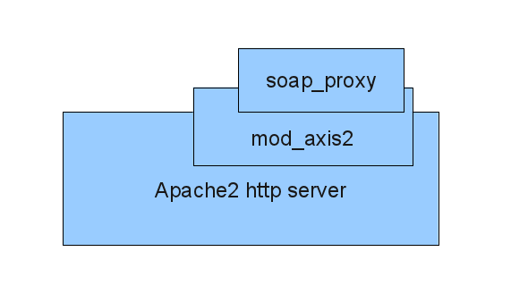

.. Architecture

Architecture
============

Soap_proxy is an adapter proxy which accepts POST request in XML  ecoded in SOAP
1.2 messages, and passes these on to EOxServer.  The proxy may also be
configured to pass the messages as POST requests to a suitable mapserver
executable instead of an EOxServer, for example for testing purposes.

Supported Interfaces
---------------------

Soap_proxy uses SOAP 1.2 over HTTP.

EOxServer responds to the following WCS-EO requests through SOAP service interface:

* DescribeCoverage
* DescribeEOCoverageSet
* GetCapabilities
* GetCoverage

Overview
--------
Soap_proxy  uses the axis2/C framework. An important feature of axis2/C is that it correctly handles SOAP 1.2 MTOM
Attachments.

The overall deployment context is shown in the figure below.
Soap_proxy is implemented as an axis2/c service, running
within the apache2 httpd server as a mod_axis2 module.

The next figure shows a sequence diagram for a typical request-response
message exchange from a client through the soap_proxy to an instance of
EOxServer.

.. figure:: images/Seq_soap_proxy.png
   :align: center

Implementation
--------------

The implementation is provided in the src directory.
The file sp_svc.c is the entry point where the Axis2/c framework calls the
soap_proxy implentation code via rpSvc_invoke(), which calls rp_dispatch_op()
to do most of the work.

