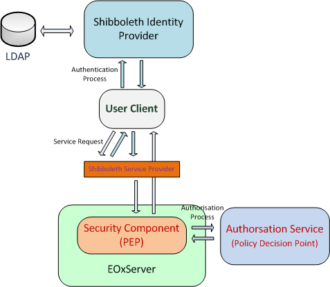

.. _rfc_15:

RFC 15: Access Control Support
==============================

:Author:     Arndt Bonitz
:Created:    2011-11-14
:Last Edit:  2011-11-15
:Status:     DRAFT 
:Discussion: http://www.eoxserver.org/wiki/DiscussionRfc15

Overview
--------

This RFC describes access control support for the EOxServer. The following figure gives an overview of the access control implementation and its different components:  

   
   *EOxServer Access Control Implementation*

The access control implementation relies on the `Shibboleth framework <http://shibboleth.internet2.edu/>`_ and parts of the `CHARON framework <http://www.enviromatics.net/charon/index.html>`_, namely the CHARON Authorisation Service. But components are open source products. Shibboleth is used for the authentication of users; the CHARON Authentication Service is responsible for making authorisation decisions if a certain request may be performed.        

Authentication
-------------- 
Authentication is not handled directly by the EOxServer components, but uses the  Shibboleth federated identity management system. In order to do this, two requirements must be met:

* A Shibboleth Identity Provider (IdP) must be available for authentication
* A Shibboleth Service Provider must be installed and configured in an `Apache HTTP Server <http://httpd.apache.org/>`_ to protect the EOxServer resource.

A user has to authenticate at an IdP in order to perform requests to a EOxServer with access control enabled. The IdP issues a SAML token which will be validated by the SP.

Is the user valid, the SP adds the user attributes by the IdP to the HTTP Header of the original service requests and conveys it to the protected EOxServer instance. The whole process ensures, that only authenticated users can access the EOxServer.

Authorisation
------------- 

As noted in the previous section, the Shibboleth system provides the underlying service all asserted user attributes. These attributes can be used to make an decision if a certain user is allowed to perform an operation on the EOxServer. The authorisation decision is not made directly in the EOxServer, but relies the CHARON Authorisation Service. 

The Authorisation Service is responsible for the authorisation of service requests. It makes use of `XACML <http://www.oasis-open.org/committees/xacml/#XACML20>`_, a XML based language for access policies. The Authorisation Service is part of the `CHAORN <http://www.enviromatics.net/charon/index.html>`_ project. The EOxServer security components are only responsible for performing an authorisation decision request on the Authorisation Server and enforcing the authorisation decision. 

EOxServer Security Component
-----------------------------

The EOxServer security component is located in the package ``eoxserver.services.auth.base`` in the EOxServer source code directory. It countains a implementation for the ``PolicyDecisionPointInterface``, which is a wrapper for CHARON Authorisation Service client. Every request for authorisation is encoded into a XACML Authorization Query and sent to the Authorisation Service. The decision (permit, deney) of the service is then enforced by the EOxServer  
