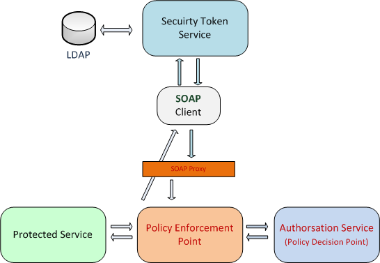

.. Identity Management System
  #-----------------------------------------------------------------------------
  # $Id$
  #
  # Project: EOxServer <http://eoxserver.org>
  # Authors: Arndt Bonitz <arndt.bonitz@ait.ac.at>
  #
  #-----------------------------------------------------------------------------
  # Copyright (C) 2011 AIT Austrian Institute of Technology GmbH
  #
  # Permission is hereby granted, free of charge, to any person obtaining a copy
  # of this software and associated documentation files (the "Software"), to
  # deal in the Software without restriction, including without limitation the
  # rights to use, copy, modify, merge, publish, distribute, sublicense, and/or
  # sell copies of the Software, and to permit persons to whom the Software is
  # furnished to do so, subject to the following conditions:
  #
  # The above copyright notice and this permission notice shall be included in
  # all copies of this Software or works derived from this Software.
  #
  # THE SOFTWARE IS PROVIDED "AS IS", WITHOUT WARRANTY OF ANY KIND, EXPRESS OR
  # IMPLIED, INCLUDING BUT NOT LIMITED TO THE WARRANTIES OF MERCHANTABILITY,
  # FITNESS FOR A PARTICULAR PURPOSE AND NONINFRINGEMENT. IN NO EVENT SHALL THE
  # AUTHORS OR COPYRIGHT HOLDERS BE LIABLE FOR ANY CLAIM, DAMAGES OR OTHER
  # LIABILITY, WHETHER IN AN ACTION OF CONTRACT, TORT OR OTHERWISE, ARISING 
  # FROM, OUT OF OR IN CONNECTION WITH THE SOFTWARE OR THE USE OR OTHER DEALINGS
  # IN THE SOFTWARE.
  #-----------------------------------------------------------------------------

.. _Identity Management System:

Identity Management System
==========================

The Identity Management System (IDMS) provides access control capabilities for 
security relevant data. The current IDMS supports EOxServer with a native 
security component for HTTP KVP and POST/XML protocol binding as well as 
external components for SOAP binding. The system is based on other free and 
open software projects, namely the `Charon Project 
<http://www.enviromatics.net/charon/>`_, the `Shibboleth 
framwork <http://shibboleth.internet2.edu/>`_ and  the `HMA Authentication 
Service <http://wiki.services.eoportal.org/tiki-index.php?page=HMA+
Authentication+Service>`_. In the context of EOxServer, the SOAP support in the 
IDMS can be used to provide authentication and authorisation capabilities for 
the `EO-WCS SOAP Proxy <http://eoxserver.org/doc/en/users/soap_proxy.html>`_. 

The IDMS uses two different schemes for authentication: The native EOxServer 
component relies on Shibboleth for Authentication, the SOAP components use the 
Charon framework. 

The approach chosen for the SOAP part of the IDMS follows the OGC best practice 
document `User Management Interfaces for Earth Observation Services 
<http://portal.opengeospatial.org/files/?artifact_id=40677>`_ for the 
authentication concept. The authentication part is following the ideas of the 
`XACML data flow pattern <http://docs.oasis-open.org/xacml/2.0/access_control-
xacml-2.0-core-spec-os.pdf>`_: The IDMS authorisation part consists of a Policy 
Decision Point (PDP, here represented through the Charon Policy Management And 
Authentication Service) and the Policy Enforcement Point (PEP, represented 
through the Charon PEP Service). The following figure gives an overview of the 
IDMS SOAP part:

   *IDMS SOAP Access Control Overview*

The HMA Authentication Service, or Security Token Service (STS), and the Charon 
PEP components were both modified in order to be compatible. This is a result 
of the ESA project `Open-standard Online Observation Service 
<http://wiki.services.eoportal.org/tiki-index.php?page=O3S>`_ (O3S). The STS 
now also supports SAML 2.0 security tokens, which the PEP components can 
interpret and validate. The IDMS supports trust relationships between identity 
providers and enforcement components on the basis of certificate stores.

The HTTP or native EOxServer part of the IDMS uses exactly the same scheme for 
authorisation as the SOAP part, but uses the Shibboleth federated identity 
management system for authentication.

.. figure:: images/IDM_HTTP_Components.png
   :align: center
   
   *IDMS EOxServer Access Control Overview* 

Two requirements must be met to use the IDMS in this case:

* A Shibboleth Identity Provider (IdP) must be available for authentication
* A Shibboleth Service Provider (SP) must be installed and configured in an 
  `Apache HTTP Server <http://httpd.apache.org/>`_ to protect the EOxServer 
  resource.

A user has to authenticate at an IdP in order to perform requests to an 
EOxServer with access control enabled. The IdP issues a SAML token which will 
be validated by the SP.

Is the user valid, the SP adds the user attributes received from the IdP to the 
HTTP Header of the original service requests and conveys it to the protected 
EOxServer instance. The whole process ensures, that only authenticated users 
can access the data and services provided by EOxServer. The attributes from 
Shibboleth are used by the EOxServer security components to make a 
XACMLAuthzDecisionQuery to the Charon Authorisation Service.

Prerequisites
-------------

The following software is needed to run the IDMS:  
 
- `Java <http://www.oracle.com/technetwork/java/index.html>`_ JDK 6 or higher 
- `Apache Tomcat <http://tomcat.apache.org/>`_ 6 or higher
- `Apache Axis2 <http://axis.apache.org/axis2/java/core/>`_ 1.4.1 or higher
- `MySQL <http://dev.mysql.com/downloads/>`_ 5 
- `Apache HTTP Server <http://httpd.apache.org/>`_ 2.x

The following software is needed to build the IDMS components:

- `Java <http://www.oracle.com/technetwork/java/index.html>`_  SDK 6 or higher
- `Apache Ant <http://ant.apache.org/>`_ 1.6.2 or higher
- `Apache Maven <http://maven.apache.org/>`_ 2 or higher

General Configuration for CHARON services:

- The Charon services need the ``acs-xbeans-1.0.jar`` dependency in the 
  ``\lib`` folder of your Axis2 installation (presumably the ``webapps/axis2`` 
  of your Apache Tomcat installation).
- Furthermore, you have to activate the EIGSecurityHandler in the 
  **Global Modules** section of your axis2 configuration 
  (``${AXIS2_HOME}/WEB-INF/conf/axis2.xml``).
- You may configure the logging for the services in the Log4J configuration 
  file (``${AXIS2_HOME}/WEB-INF/classes/log4j.properties``).

Both, the Security Token Service and the PEP service make use of Java 
Keystores: The IDMS uses  Keystores to store a) the certificate used by the 
Security Token Service for signing SAML tokens and b) the public keys of those 
authenticating authorities trusted by the Policy Enforcement Point. The 
``keytool`` of the Java distribution can be used to create and manipulate 
Java Keystores:

- The following command creates a new Keystore with the password :secret: and 
  a suitable key pair with the alias :authenticate: for the Security Token 
  Service:
  
    ``keytool -genkey -alias authenticate -keyalg RSA -keystore keystore.jks 
    -storepass secret -validity 360``

- The following command exports the public certificate from a key pair 
  :authenticate: to the file ``authn.crt``:
  
    ``keytool -export -alias authenticate -file authn.crt -keystore 
    keystore.jks``

- The following command imports a certificate to a Keystore:

    ``keytool -import -alias trusted_sts -file authn.crt -keystore 
    keystore.jks``

You can use the Apache HTTP Server as a proxy, it will enable your services 
running in Tomcat to be accessible over the Apache server. This can be useful 
when your services have to be accessible over the HTTP standard port *80*:

- First you have to enable ``mod_proxy_ajp`` and ``mod_proxy``.
- Create a virtual host in your ``httpd.conf``:

    .. code-block:: apache

        <VirtualHost *:80>
           ServerName server.example.com
        
           <Proxy *>
             AddDefaultCharset Off
             Order deny,allow
             Allow from all
           </Proxy>
        
           ProxyPass /services/AuthenticationService ajp://localhost:8009/axis2/services/AuthenticationService
           ProxyPassReverse /services/AuthenticationService ajp://localhost:8009/axis2/services/AuthenticationService 
           
        </VirtualHost>

- The ``ProxyPass`` and ``ProxyPassReverse`` directives have to point to your 
  services. Please note that the Tomcat server hosting your services must have 
  the AJP interface enabled.  
 
LDAP Directory
--------------
The IDMS uses a LDAP directory to store user data (attributes, passwords, etc). 
You can use any directory implementation, supporting the Lightweight Directory 
Access Protocol (v3).

Known working implementations are:

* `Apache Directory Service <http://directory.apache.org/>`_
* `OpenLDAP <http://openldap.org>`_

A good graphical client for LDAP directories is the `Apache Directory Studio 
<http://directory.apache.org/studio/>`_.

Security Token Service
-----------------------

The Security Token Service (STS) is responsible for the authentication of users 
and is documented and specified in the OASIS `WS-Trust 
<http://docs.oasis-open.org/ws-sx/ws-trust/200512/ws-trust-1.3-os.html>`_ 
specification. The authentication assertion produced by the STS is formulated 
in the `Security Assertion Markup Language <http://www.oasis-open.org/committees
/download.php/3406/oasis-sstc-saml-core-1.1.pdf>`_. A client trying to access a 
service secured by the IDMS has to embed this assertion in every service 
request.

The STS implementation used by the IDMS is the `HMA Authentication Service 
<http://wiki.services.eoportal.org/tiki-index.php?page=HMA+Authentication+
Service>`_. Please refer to the documentation included in the ``\docs`` folder 
of the HMA Authentication Service package how to compile the service. This 
document will only deal on how to install the service. To deploy the service 
successfully, you first have to install and configure an LDAP service. Then 
proceed with the following steps:

* Put the ``authentication_v2.1.aar`` folder in the 
  ``${AXIS2_HOME}/WEB-INF/services/`` folder. The ``authentication_v2.1.aar`` 
  folder contains all configuration files for the STS.
* The main configuration of the service takes place in the 
  ``authentication-service.properties``.
* Using the ``saml-ldap-attributes-mapping.properties``, you can map your LDAP 
  attributes to SAML attributes if necessary. 
* You may configure the logging behaviour in the Log4J configuration file in 
  ``authentication-service-log4j.properties``.

Following properties can be set in the ``authentication-service.properties`` 
configuration file:

``LDAPURL``
    URL to the LDAP service.
``LDAPSearchContext``
    Search context for users.
``LDAPPrincipal``
    The *"user name"* used by the STS to access the LDAP service.
``LDAPCredentials`` 
    The password used in combination with ``LDAPPrincipal``
``KEYSTORE_LOCATION`` 
    Path to the Keystore file containing the certificate used for signing the 
    SAML tokens.
``KEYSTORE_PASSWORD``
    The keystore password. 
``AUTHENTICATION_CERTIFICATE_ALIAS``
    Alias of the keystore entry wich is used for signing the SAML tokens.
``AUTHENTICATION_CERTIFICATE_PASSWORD``
    Password corresponding to the ``AUTHENTICATION_CERTIFICATE_ALIAS``
``CLIENT_CERTIFICATE_ALIASES`` 
    Comma serperated list with keystore aliases of trusted clients.
``SAML_TOKEN_EXPIRY_PERIOD`` 
    Defines how long a SAML token is valid.
``SAML_ASSERTION_ISSUER`` 
    SAML Token issure.
``SAML_ASSERTION_ID_PREFIX`` 
    SAML Token prefix.
``SAML_ASSERTION_NODE_NAMESPACE``
    Namespace for attribute assertions.
``ENCRYTION_ENABLE`` 
    Enables or disables encryption of SAML tokens.
``INCLUDE_CERTIFICATE``
    Enables or disables inclusion of SAML tokens.
``LOG4J_CONFIG_LOCATION`` 
    Path to the Log4J configuration file.

Authorisation Service
---------------------

The Authorisation Service is responsible for the authorisation of service 
requests. It makes use of `XACML <http://www.oasis-open.org/committees/xacml/
#XACML20>`_, a XML based language for access policies. The Authorisation 
Service is part of the `CHAORN <http://www.enviromatics.net/charon/index.html>`_
project. 

The Authorisation Service relies on a MySQL database to store all XACML 
policies. So in order to install the Authorisation Service, you first need to 
prepare a MySQL database: 

* Install the MySQL database on your system.
* Change the *root* password. You can use the command line for this:

    ``mysqladmin -u root password 'root' -p``

* Run the SQL script bundle with the Authorisation Service in order to create 
  the policy database:

    ``mysql -u root -h localhost -p < PolicyAuthorService.sql``

The Service needs the following additional dependencies in the 
``${AXIS2_HOME}\lib`` folder:

- ``mysql-connector-java-5.1.6.jar``
- ``spring-2.5.1.jar``

The next step is deploying the Authorisation Service, therefore extract the ZIP 
archive into the directory of your ``${AXIS2_HOME}``.

Now you have to configure the service. All configuration files are in the 
``${AXIS2_HOME}/WEB-INF/classes`` folder and its sub-folders.

- Open the ``PolicyAuthorService.properties`` and change the ``axisURL`` 
  parameter to the URL URL where you are actually deploying your service.
- You can change the database connection in the ``config/GeoPDP.xml`` 
  configuration file if necessary. 

Policy Enforcement Point Service
--------------------------------

The Policy Enforcement Point enforces the authorisation decisions made by the 
Authorisation Service. 

The next step is deploying the PEP Service, therefore extract the ZIP archive 
into the directory of your ``${AXIS2_HOME}``.

Now you have to configure the service. The configuration files are in the 
``${AXIS2_HOME}/WEB-INF/classes`` folder. Open the ``PEPConfiguration.xml`` to 
configure the service. The configuration file already contains documentation of 
the single elements.

SOAP Proxy
----------

The SOAP Proxy is used as a proxy for a secured service. This means a user 
client does not communicate directly with a secured service, instead it sends 
all requests to the proxy service.  

First, you have to generate the proxy service. In order to do this, open a 
shell and navigate to the ``${ProxyCodeGen_HOME}/bin`` directory. Run the 
script to generate the proxy service:

* Linux, Unices:

    ``./ProxyGen.sh -wsdl path/to/wsdl``

* Windows:

    ``.\ProxyGen.bat -wsdl path\to\wsdl``

The parameter ``-wsdl`` points to a file with the WSDL of the secured service.
 
After a successful service generation, the folder ``${ProxyCodeGen_HOME}/tmp/
dist`` contains the new proxy service. Take the service zip and deploy it by 
unpacking its content to the ``${AXIS2_HOME}`` folder. For MTOM support, please 
make sure that the parameter ``enableMTOM`` in the file 
``${AXIS2_HOME}/axis2.xml`` is enabled.

Edit the ``ProxyConfiguration_${SERVICE_NAME}.xml`` to configure the service. 
The configuration file already contains documentation of the single elements.

Shibboleth Identity Provider
----------------------------

The Shibboleth IdP is implemented as an Java Servlet, thus it needs an 
installed Servlet container. The Shibboleth project offers `an installation 
manual for the Shibboleth IdP on their website <https://wiki.shibboleth.net/
confluence/display/SHIB2/IdPInstall>`_. This documentation will provide help 
for the basic configuration to get the authentication process working with your 
EOxServer instance and also the installation process for the use with Tomcat 
and Apache HTTPD. Before you begin with your installation, set up your Tomcat 
servlet container and install and configure an LDAP service.

Important URLs for your Shibboleth IDP:
 
- Status message: ``https://${IDPHOST}/idp/profile/Status ``
- Information page: ``https://${IDPHOST}/idp/status``
- Metadata: ``https://${IDPHOST}/idp/profile/Metadata/SAML`` 

`Warning: IdP resource paths are case sensitive!`

* `Download <http://shibboleth.internet2.edu/downloads.html>`_ the IdP and 
  unzip the archive.
* Run either ./install.sh (on Linxu/Unix systems) or install.bat (on Windows 
  systems).
* Follow the on-screen instructions of the script. 

Your ``${IDP_HOME}`` directory contains the following directories:

* ``bin``:  This directory contains various tools useful in running, testing, 
  or deploying the IdP
* ``conf``: This directory contains all the configuration files for the IdP
* ``credentials``: This is were the IdP's signing and encryption credential, 
  called idp.key and idp.crt, is stored
* ``lib``: This directory contains various code libraries used by the tools in 
  bin/
* ``logs``: This directory contains the log files for the IdP . **Don't forget 
  to make this writeable for your Tomcat server!** 
* ``metadata``: This is the directory in which the IdP will store its metadata, 
  in a file called idp-metadata.xml. It is recommend you store any other 
  retrieved metadata here as well.
* ``war``: This contains the web application archive (war) file that you will 
  deploy into the servlet container

The next step is to deploy the IdP into your Tomcat:
* Increase the memory reserved for Tomcat. Recommended values are 
  ``-Xmx512m -XX:MaxPermSize=128m``.
* Add the libraries endorsed by the Shibboleth project to your endorsed Tomcat 
  directories: ``-Djava.endorsed.dirs=${IDP_HOME}/lib/endorsed/`` 
* Create a new XML document ``idp.xml`` in ``${TOMCAT_HOME}/conf/Catalina/
  localhost/``.
* Insert the following content:  

    .. code-block:: xml

        <Context docBase="${IDP_HOME}/war/idp.war"
                 privileged="true"
                 antiResourceLocking="false"
                 antiJARLocking="false"
                 unpackWAR="false"
                 swallowOutput="true" />                  

* Dont't forget to replace ``${IDP_HOME}`` with the appropriate path. 

To use the Apache HTTP server as an proxy for your IdP, you have to generate a 
certificate and a key file for SSL/TLS first. 

* Generate a private key:

    ``openssl genrsa -des3 -out server.key 1024``

* Generate a CSR (Certificate Signing Request):

    ``openssl req -new -key server.key -out server.csr``

* Make a copy from the the original server key:

    ``cp server.key copy_of_server.key``

* Remove the Passphrase from your Key:

    ``openssl rsa -in copy_of_server.key -out server.key``

* Generating a Self-Signed Certificate:

    ``openssl x509 -req -days 365 -in server.csr -signkey server.key -out 
    server.crt``

The next step is to configure your Apache HTTP Server:

- First you have to enable ``mod_proxy_ajp``, ``mod_proxy`` and ``mod_ssl``.
- Create a new configuration file for your SSL hosts (for example 
  ``ssl_hosts.conf``).
- Add a new virtual host in your new hosts file. Please note the comments in 
  the virtual host configuration. 

    .. code-block:: apache

        <VirtualHost _default_:443>

            # Set appropriate document root here
            DocumentRoot "/var/www/"
            
            # Set your designated IDP host here    
            ServerName ${IDP_HOST} 

            # Set your designated logging directory here
            ErrorLog logs/ssl_error_log
            TransferLog logs/ssl_access_log
            LogLevel warn

            SSLEngine on

            SSLProtocol all -SSLv2

             # Important: mod_ssl should not verify the provided certificates
            SSLVerifyClient optional_no_ca

            SSLCipherSuite ALL:!ADH:!EXPORT:!SSLv2:RC4+RSA:+HIGH:+MEDIUM:+LOW

            # Set the correct paths to your certificate and key here
            SSLCertificateFile    ${IDP_HOST_CERTIFICATE} 
            SSLCertificateKeyFile ${IDP_HOST_CERTIFICATE_KEY} 

            <Files ~ "\.(cgi|shtml|phtml|php3?)$">
                SSLOptions +StdEnvVars
            </Files>
            <Directory "/var/www/cgi-bin">
                SSLOptions +StdEnvVars
            </Directory>

            # AJP Proxy to your IDP servlet
            ProxyPass /idp/ ajp://localhost:8009/idp/ 

            SetEnvIf User-Agent ".*MSIE.*" nokeepalive ssl-unclean-shutdown downgrade-1.0 force-response-1.0

            CustomLog logs/ssl_request_log "%t %h %{SSL_PROTOCOL}x %{SSL_CIPHER}x \"%r\" %b"

        </VirtualHost>

- Restart your HTTP server.
 
The next step is to configure our IdP Service with an LDAP service. Please keep 
in mind that this documentation can only give a small insight into all 
configuration possibilities of Shibboleth. 

Open the ``handler.xml``

* Add a new LoginHandler

    .. code-block:: xml

        <LoginHandler xsi:type="UsernamePassword" 
                      jaasConfigurationLocation="file://${IDP_HOME}/conf/login.config">
                      <AuthenticationMethod>urn:oasis:names:tc:SAML:2.0:ac:classes:PasswordProtectedTransport</AuthenticationMethod>
        </LoginHandler>

* Remove (or comment out) the LoginHandler element of type RemoteUser.

Open the ``login.config`` and comment out or delete the other entries that 
might exist. Add your own LDAP configuration::

    ShibUserPassAuth {    
      edu.vt.middleware.ldap.jaas.LdapLoginModule required
         host="${LDAP_HOST}"
         port="${LDAP_PORT}"
         serviceUser="${LDAP_ADMIN}"
         serviceCredential="${LDAP_ADMIN_PASSWORD}"
         base="${LDAP_USER_BASE}"
         ssl="false"
         userField="uid"
         subtreeSearch="true";      
    };

Enable your LDAP directory as attribute provider:

* Open the ``attribute-resolver.xml``.
* Add your LDAP: 

    .. code-block:: xml

        <resolver:DataConnector id="localLDAP" xsi:type="LDAPDirectory" 
                  xmlns="urn:mace:shibboleth:2.0:resolver:dc" ldapURL="ldap://${LDAP_HOST}:${LDAP_PORT}" 
                  baseDN="${LDAP_USER_BASE}" principal="${LDAP_ADMIN}" 
                  principalCredential="${LDAP_ADMIN_PASSWORD}">
        <FilterTemplate>
            <![CDATA[ 
                  (uid=$requestContext.principalName) 
            ]]> 
        </FilterTemplate> 
        </resolver:DataConnector>

* Configure the IdP to retrieve the attributes by adding new attribute 
  definitions:

    .. code-block:: xml

        <resolver:AttributeDefinition id="transientId" xsi:type="ad:TransientId">
            <resolver:AttributeEncoder xsi:type="enc:SAML1StringNameIdentifier"
                nameFormat="urn:mace:shibboleth:1.0:nameIdentifier"/>
            <resolver:AttributeEncoder xsi:type="enc:SAML2StringNameID"
                nameFormat="urn:oasis:names:tc:SAML:2.0:nameid-format:transient"/>
        </resolver:AttributeDefinition>

        <resolver:AttributeDefinition id="displayName" xsi:type="Simple"
            xmlns="urn:mace:shibboleth:2.0:resolver:ad" sourceAttributeID="displayName">
            <resolver:Dependency ref="localLDAP"/>
            <resolver:AttributeEncoder xsi:type="SAML1String"
                xmlns="urn:mace:shibboleth:2.0:attribute:encoder"
                name="urn:mace:dir:attribute-def:displayName"/>
            <resolver:AttributeEncoder xsi:type="SAML2String"
                xmlns="urn:mace:shibboleth:2.0:attribute:encoder"
                name="urn:oid:2.16.840.1.113730.3.1.241" friendlyName="displayName"/>
        </resolver:AttributeDefinition>

        <resolver:AttributeDefinition id="givenName" xsi:type="Simple"
            xmlns="urn:mace:shibboleth:2.0:resolver:ad" sourceAttributeID="givenName">
            <resolver:Dependency ref="localLDAP"/>
            <resolver:AttributeEncoder xsi:type="SAML1String"
                xmlns="urn:mace:shibboleth:2.0:attribute:encoder"
                name="urn:mace:dir:attribute-def:givenName"/>
            <resolver:AttributeEncoder xsi:type="SAML2String"
                xmlns="urn:mace:shibboleth:2.0:attribute:encoder" name="urn:oid:2.5.4.42"
                friendlyName="givenName"/>
        </resolver:AttributeDefinition>

        <resolver:AttributeDefinition id="description" xsi:type="Simple"
            xmlns="urn:mace:shibboleth:2.0:resolver:ad" sourceAttributeID="description">
            <resolver:Dependency ref="localLDAP"/>
            <resolver:AttributeEncoder xsi:type="SAML1String"
                xmlns="urn:mace:shibboleth:2.0:attribute:encoder"
                name="urn:mace:dir:attribute-def:description"/>
            <resolver:AttributeEncoder xsi:type="SAML2String"
                xmlns="urn:mace:shibboleth:2.0:attribute:encoder" name="urn:oid:2.5.4.13"
                friendlyName="description"/>
        </resolver:AttributeDefinition>

        <resolver:AttributeDefinition id="cn" xsi:type="Simple"
            xmlns="urn:mace:shibboleth:2.0:resolver:ad" sourceAttributeID="cn">
            <resolver:Dependency ref="localLDAP"/>
            <resolver:AttributeEncoder xsi:type="SAML1String"
                xmlns="urn:mace:shibboleth:2.0:attribute:encoder" name="urn:mace:dir:attribute-def:cn"/>
            <resolver:AttributeEncoder xsi:type="SAML2String"
                xmlns="urn:mace:shibboleth:2.0:attribute:encoder" name="urn:oid:2.5.4.3"
                friendlyName="cn"/>
        </resolver:AttributeDefinition>

        <resolver:AttributeDefinition id="sn" xsi:type="Simple"
            xmlns="urn:mace:shibboleth:2.0:resolver:ad" sourceAttributeID="sn">
            <resolver:Dependency ref="localLDAP"/>
            <resolver:AttributeEncoder xsi:type="SAML1String"
                xmlns="urn:mace:shibboleth:2.0:attribute:encoder" name="urn:mace:dir:attribute-def:sn"/>
            <resolver:AttributeEncoder xsi:type="SAML2String"
                xmlns="urn:mace:shibboleth:2.0:attribute:encoder" name="urn:oid:2.5.4.4"
                friendlyName="sn"/>
        </resolver:AttributeDefinition>

        <resolver:AttributeDefinition id="uid" xsi:type="Simple"
            xmlns="urn:mace:shibboleth:2.0:resolver:ad" sourceAttributeID="uid">
            <resolver:Dependency ref="localLDAP"/>
            <resolver:AttributeEncoder xsi:type="SAML1String"
                xmlns="urn:mace:shibboleth:2.0:attribute:encoder" name="urn:mace:dir:attribute-def:uid"/>
            <resolver:AttributeEncoder xsi:type="SAML2String"
                xmlns="urn:mace:shibboleth:2.0:attribute:encoder" name="urn:oid:2.5.4.45"
                friendlyName="uid"/>
        </resolver:AttributeDefinition>

Add the new attributes to your ``attribute-filter.xml`` by adding a new 
AttributeFilterPolicy: 

.. code-block:: xml 
   
    <afp:AttributeFilterPolicy id="attribFilter">
        <afp:PolicyRequirementRule xsi:type="basic:ANY"/>

        <afp:AttributeRule attributeID="givenName">
            <afp:PermitValueRule xsi:type="basic:ANY"/>
        </afp:AttributeRule>

        <afp:AttributeRule attributeID="displayName">
            <afp:PermitValueRule xsi:type="basic:ANY"/>
        </afp:AttributeRule>

        <afp:AttributeRule attributeID="description">
            <afp:PermitValueRule xsi:type="basic:ANY"/>
        </afp:AttributeRule>

        <afp:AttributeRule attributeID="cn">
            <afp:PermitValueRule xsi:type="basic:ANY"/>
        </afp:AttributeRule>

        <afp:AttributeRule attributeID="sn">
            <afp:PermitValueRule xsi:type="basic:ANY"/>
        </afp:AttributeRule>

        <afp:AttributeRule attributeID="uid">
            <afp:PermitValueRule xsi:type="basic:ANY"/>
        </afp:AttributeRule>

    </afp:AttributeFilterPolicy>

Now you have to check if the generated metadata is correct. To do this, open 
the ``idp-metadata.xml`` file. Known issues are:

* Incorrect ports: For example port 8443 at the AttributeService Bindings 
  instead of no specific port.
* Wrong X509Certificate for Attribute Resolver. Use your previously generated 
  SSL/TLS ``${IDP_HOST_CERTIFICATE}`` instead.     

After this, restart your Shibboleth IdP.

Shibboleth Service Provider
---------------------------

The installation procedure for the Shibboleth SP is different for all 
supported Operating Systems. The project describes the different installation 
methods in an `own installation manual <https://wiki.shibboleth.net/confluence/
display/SHIB2/Installation>`_. This documentation will provide help for the 
basic configuration to get the authentication process working with your 
EOxServer instance. 

Important URLs for your Shibboleth SP:
 
- Status page: ``https://${SPHOST}/Shibboleth.sso/Status``
- Metadata: ``https://${SPHOST}/Shibboleth.sso/Metadata``
- Session summary: ``https://${SPHOST}/Shibboleth.sso/Session``
- Local logout: ``https://${SPHOST}/Shibboleth.sso/Logout`` 

`Warning: SP resource paths are case sensitive!`

**STEP 1**

The Shibboleth SP has two relevant configuration files. We begin with the 
``attribute-map.xml`` file, where we configure the mapping of the attributes 
received from the IdP to the secured service (in our case the EOxServer): 

.. code-block:: xml

    <Attributes xmlns="urn:mace:shibboleth:2.0:attribute-map" xmlns:xsi="http://www.w3.org/2001/XMLSchema-instance">
    
        <!-- First some useful eduPerson attributes that many sites might use. -->
        
        <Attribute name="urn:mace:dir:attribute-def:eduPersonPrincipalName" id="eppn">
            <AttributeDecoder xsi:type="ScopedAttributeDecoder"/>
        </Attribute>
        <Attribute name="urn:oid:1.3.6.1.4.1.5923.1.1.1.6" id="eppn">
            <AttributeDecoder xsi:type="ScopedAttributeDecoder"/>
        </Attribute>
        
        <Attribute name="urn:mace:dir:attribute-def:eduPersonScopedAffiliation" id="affiliation">
            <AttributeDecoder xsi:type="ScopedAttributeDecoder" caseSensitive="false"/>
        </Attribute>
        <Attribute name="urn:oid:1.3.6.1.4.1.5923.1.1.1.9" id="affiliation">
            <AttributeDecoder xsi:type="ScopedAttributeDecoder" caseSensitive="false"/>
        </Attribute>
        
        <Attribute name="urn:mace:dir:attribute-def:eduPersonAffiliation" id="unscoped-affiliation">
            <AttributeDecoder xsi:type="StringAttributeDecoder" caseSensitive="false"/>
        </Attribute>
        <Attribute name="urn:oid:1.3.6.1.4.1.5923.1.1.1.1" id="unscoped-affiliation">
            <AttributeDecoder xsi:type="StringAttributeDecoder" caseSensitive="false"/>
        </Attribute>
        
        <Attribute name="urn:mace:dir:attribute-def:eduPersonEntitlement" id="entitlement"/>
        <Attribute name="urn:oid:1.3.6.1.4.1.5923.1.1.1.7" id="entitlement"/>
    
        <!-- A persistent id attribute that supports personalized anonymous access. -->
        
        <!-- First, the deprecated/incorrect version, decoded as a scoped string: -->
        <Attribute name="urn:mace:dir:attribute-def:eduPersonTargetedID" id="targeted-id">
            <AttributeDecoder xsi:type="ScopedAttributeDecoder"/>
            <!-- <AttributeDecoder xsi:type="NameIDFromScopedAttributeDecoder" formatter="$NameQualifier!$SPNameQualifier!$Name" defaultQualifiers="true"/> -->
        </Attribute>
        
        <!-- Second, an alternate decoder that will decode the incorrect form into the newer form. -->
        <!--
        <Attribute name="urn:mace:dir:attribute-def:eduPersonTargetedID" id="persistent-id">
            <AttributeDecoder xsi:type="NameIDFromScopedAttributeDecoder" formatter="$NameQualifier!$SPNameQualifier!$Name" defaultQualifiers="true"/>
        </Attribute>
        -->
        
        <!-- Third, the new version (note the OID-style name): -->
        <Attribute name="urn:oid:1.3.6.1.4.1.5923.1.1.1.10" id="persistent-id">
            <AttributeDecoder xsi:type="NameIDAttributeDecoder" formatter="$NameQualifier!$SPNameQualifier!$Name" defaultQualifiers="true"/>
        </Attribute>
    
        <!-- Fourth, the SAML 2.0 NameID Format: -->
        <Attribute name="urn:oasis:names:tc:SAML:2.0:nameid-format:persistent" id="persistent-id">
            <AttributeDecoder xsi:type="NameIDAttributeDecoder" formatter="$NameQualifier!$SPNameQualifier!$Name" defaultQualifiers="true"/>
        </Attribute>
        
        <!--Examples of LDAP-based attributes, uncomment to use these... -->
        <Attribute name="urn:mace:dir:attribute-def:cn" id="cn"/>
        <Attribute name="urn:mace:dir:attribute-def:sn" id="sn"/>
        <Attribute name="urn:mace:dir:attribute-def:givenName" id="givenName"/>
        <Attribute name="urn:mace:dir:attribute-def:mail" id="mail"/>
        <Attribute name="urn:mace:dir:attribute-def:telephoneNumber" id="telephoneNumber"/>
        <Attribute name="urn:mace:dir:attribute-def:title" id="title"/>
        <Attribute name="urn:mace:dir:attribute-def:initials" id="initials"/>
        <Attribute name="urn:mace:dir:attribute-def:description" id="description"/>
        <Attribute name="urn:mace:dir:attribute-def:carLicense" id="carLicense"/>
        <Attribute name="urn:mace:dir:attribute-def:departmentNumber" id="departmentNumber"/>
        <Attribute name="urn:mace:dir:attribute-def:displayName" id="displayName"/>
        <Attribute name="urn:mace:dir:attribute-def:employeeNumber" id="employeeNumber"/>
        <Attribute name="urn:mace:dir:attribute-def:employeeType" id="employeeType"/>
        <Attribute name="urn:mace:dir:attribute-def:preferredLanguage" id="preferredLanguage"/>
        <Attribute name="urn:mace:dir:attribute-def:manager" id="manager"/>
        <Attribute name="urn:mace:dir:attribute-def:seeAlso" id="seeAlso"/>
        <Attribute name="urn:mace:dir:attribute-def:facsimileTelephoneNumber" id="facsimileTelephoneNumber"/>
        <Attribute name="urn:mace:dir:attribute-def:street" id="street"/>
        <Attribute name="urn:mace:dir:attribute-def:postOfficeBox" id="postOfficeBox"/>
        <Attribute name="urn:mace:dir:attribute-def:postalCode" id="postalCode"/>
        <Attribute name="urn:mace:dir:attribute-def:st" id="st"/>
        <Attribute name="urn:mace:dir:attribute-def:l" id="l"/>
        <Attribute name="urn:mace:dir:attribute-def:o" id="o"/>
        <Attribute name="urn:mace:dir:attribute-def:ou" id="ou"/>
        <Attribute name="urn:mace:dir:attribute-def:businessCategory" id="businessCategory"/>
        <Attribute name="urn:mace:dir:attribute-def:physicalDeliveryOfficeName" id="physicalDeliveryOfficeName"/>
    
        <Attribute name="urn:oid:2.5.4.3" id="cn"/>
        <Attribute name="urn:oid:2.5.4.4" id="sn"/>
        <Attribute name="urn:oid:2.5.4.42" id="givenName"/>
        <Attribute name="urn:oid:0.9.2342.19200300.100.1.3" id="mail"/>
        <Attribute name="urn:oid:2.5.4.20" id="telephoneNumber"/>
        <Attribute name="urn:oid:2.5.4.12" id="title"/>
        <Attribute name="urn:oid:2.5.4.43" id="initials"/>
        <Attribute name="urn:oid:2.5.4.13" id="description"/>
        <Attribute name="urn:oid:2.16.840.1.113730.3.1.1" id="carLicense"/>
        <Attribute name="urn:oid:2.16.840.1.113730.3.1.2" id="departmentNumber"/>
        <Attribute name="urn:oid:2.16.840.1.113730.3.1.3" id="employeeNumber"/>
        <Attribute name="urn:oid:2.16.840.1.113730.3.1.4" id="employeeType"/>
        <Attribute name="urn:oid:2.16.840.1.113730.3.1.39" id="preferredLanguage"/>
        <Attribute name="urn:oid:2.16.840.1.113730.3.1.241" id="displayName"/>
        <Attribute name="urn:oid:0.9.2342.19200300.100.1.10" id="manager"/>
        <Attribute name="urn:oid:2.5.4.34" id="seeAlso"/>
        <Attribute name="urn:oid:2.5.4.23" id="facsimileTelephoneNumber"/>
        <Attribute name="urn:oid:2.5.4.9" id="street"/>
        <Attribute name="urn:oid:2.5.4.18" id="postOfficeBox"/>
        <Attribute name="urn:oid:2.5.4.17" id="postalCode"/>
        <Attribute name="urn:oid:2.5.4.8" id="st"/>
        <Attribute name="urn:oid:2.5.4.7" id="l"/>
        <Attribute name="urn:oid:2.5.4.10" id="o"/>
        <Attribute name="urn:oid:2.5.4.11" id="ou"/>
        <Attribute name="urn:oid:2.5.4.15" id="businessCategory"/>
        <Attribute name="urn:oid:2.5.4.19" id="physicalDeliveryOfficeName"/>
    
        <Attribute name="urn:oid:2.5.4.45" id="uid"/>
    </Attributes>

The next step is to edit the ``shibboleth2.xml`` file: Locate the element 
``ApplicationDefaults`` and set the value of the attribute ``entityID`` to  
``${SP_HOST}\Shibboleth``.

**STEP 2**

The next step is to configure your Apache HTTP Server. To do this, you have to 
generate a certificate and a key file for your SSL/TLS Shibboleth SP Host first 
(see Shibboleth IdP section). Then add a virtual host to your Apache HTTP 
Server: 

.. code-block:: apache

     <VirtualHost _default_:443>
     
        # Include the apache22.conf from Shibboleth
        import ${SP_HOME}/apache22.config 
        
        # Set appropriate document root here
        DocumentRoot "/var/www/"
        
        # Set your designated IDP host here    
        ServerName ${IDP_HOST} 

        # Set your designated logging directory here
        ErrorLog logs/ssl_error_log
        TransferLog logs/ssl_access_log
        LogLevel warn
                                        
        SSLEngine on

        SSLProtocol all -SSLv2

         # Important: mod_ssl should not verify the provided certificates
        SSLVerifyClient optional_no_ca

        SSLCipherSuite ALL:!ADH:!EXPORT:!SSLv2:RC4+RSA:+HIGH:+MEDIUM:+LOW

        # Set the correct paths to your certificate and key here
        SSLCertificateFile    ${SP_HOST_CERTIFICATE} 
        SSLCertificateKeyFile ${SP_HOST_CERTIFICATE_KEY} 

        <Files ~ "\.(cgi|shtml|phtml|php3?)$">
            SSLOptions +StdEnvVars
        </Files>
        <Directory "/var/www/cgi-bin">
            SSLOptions +StdEnvVars
        </Directory>

        SetEnvIf User-Agent ".*MSIE.*" nokeepalive ssl-unclean-shutdown downgrade-1.0 force-response-1.0

        CustomLog logs/ssl_request_log "%t %h %{SSL_PROTOCOL}x %{SSL_CIPHER}x \"%r\" %b"

    </VirtualHost>   

**STEP 3**

Open ``shibboleth2.xml`` and change the ``entityID`` in the element 
``ApplicationDefaults`` to your ``${SP_HOST}``. Restart your SP and try to access 
your SP Metadata ``https://${SPHOST}/Shibboleth.sso/Metadata``
 

Configure Shibboleth SP and IdP
-------------------------------

* Download SP Metadata and store it locally as ``${SP_METADATA_FILE}``.
* Open the ``relying-party.xml`` of the Shibboleth IdP and change the Metadata 
  Provider entry to 

    .. code-block:: xml

        <!-- MetadataProvider the combining other MetadataProviders -->
        <metadata:MetadataProvider id="ShibbolethMetadata" xsi:type="metadata:ChainingMetadataProvider">

            <!-- Load the IdP's own metadata.  This is necessary for artifact support. -->
            <metadata:MetadataProvider id="IdPMD" xsi:type="metadata:ResourceBackedMetadataProvider">
                <metadata:MetadataResource xsi:type="resource:FilesystemResource"
                    file="${SP_METADATA_FILE}"/>
            </metadata:MetadataProvider>

            <MetadataProvider id="URLMD" xsi:type="FilesystemMetadataProvider"
                xmlns="urn:mace:shibboleth:2.0:metadata"
                metadataFile="/opt/shibboleth-idp/conf/sp-metadata.xml">

                <MetadataFilter xsi:type="ChainingFilter" xmlns="urn:mace:shibboleth:2.0:metadata">
                    <MetadataFilter xsi:type="EntityRoleWhiteList"
                        xmlns="urn:mace:shibboleth:2.0:metadata">
                        <RetainedRole>samlmd:SPSSODescriptor</RetainedRole>
                    </MetadataFilter>
                </MetadataFilter>

            </MetadataProvider>

        </metadata:MetadataProvider>

* Add the ``${SP_HOST_CERTIFICATE}`` to your Java Keystore:

    ``keytool -import -file ${SP_HOST_CERTIFICATE} -alias ${SP_HOST}  -keystore ${JAVA_JRE_HOME}\lib\security\cacerts``

* Open ``shibboleth2.xml`` of your Shibboleth SP add a new SessionInitiator to 
  the ``Sessions`` element:

    .. code-block:: xml

        <!-- Default example directs to a specific IdP's SSO service (favoring SAML 2 over Shib 1). -->
        <SessionInitiator type="Chaining" Location="/Login"
                    isDefault="true" id="Intranet" relayState="cookie"
                    entityID="https://{IDP_HOST}/idp/shibboleth">
                    <SessionInitiator type="SAML2" acsIndex="1"
                      template="bindingTemplate.html"/>
                    <SessionInitiator type="Shib1" acsIndex="5"/>
        </SessionInitiator>  

* Then add a new MetadataProvider:

    .. code-block:: xml

        <!-- Chains together all your metadata sources. -->
        <MetadataProvider type="Chaining">
                    <MetadataProvider type="XML"
                                uri="https://{IDP_HOST}/idp/profile/Metadata/SAML"
                                backingFilePath="federation-metadata.xml"
                                reloadInterval="7200">
                    </MetadataProvider>
        </MetadataProvider>
    
* Restart your IdP, the SP and the Apache HTTPD

Configure the EOxServer Security Components
-------------------------------------------

The configuration of the EOxServer security components is done in the 
``eoxserver.conf`` configuration file of your EOxServer instance. All security 
related configuration is done in the section ``[services.auth.base]``:

* ``pdp_type``: Determines the Policy Decision Point type; defaults to ``none`` 
  which deactivates authorisation. Currently, only the type ``charonpdp`` is 
  implemented.
* ``authz_service``: The URL of the Authorisation Service.
* ``attribute_mapping``: The file path to a dictionary with a mapping from 
  identity attributes received from the Shibboleth IdP to a 
  XACMLAuthzDecisionQuery. If the key is set to ``default``, a standard 
  dictionary is used.
* ``serviceID``: Identifier for the EOxServer instance to an external 
  Authorisation Service. Is used as resource ID in an XACMLAuthzDecisionQuery. 
  If the key is set to ``default``, the host name will be used.
* ``allowLocal``: If set to ``True``, the security components will alloways allow
  access to requests from the local machine. *Use with care!*

Adding new Subject attributes to the EOxServer Security Components
------------------------------------------------------------------

In order to register new Subject attributes from your LDAP to the IDMS, you 
have to configure the Shibboleth IdP, the Shibboleth SP, and the EOxServer. 
Let's assume we want to add the new attribute `foo`.

**Shibboleth IdP**

Add a new AttributeResolver to your ``attribute-resolver.xml`` configuration 
file:

.. code-block:: xml

    <resolver:AttributeDefinition id="foo" xsi:type="Simple"
        xmlns="urn:mace:shibboleth:2.0:resolver:ad" sourceAttributeID="description">
        <resolver:Dependency ref="localLDAP"/>
        <resolver:AttributeEncoder xsi:type="SAML1String"
            xmlns="urn:mace:shibboleth:2.0:attribute:encoder"
            name="urn:mace:dir:attribute-def:description"/>
        <resolver:AttributeEncoder xsi:type="SAML2String"
            xmlns="urn:mace:shibboleth:2.0:attribute:encoder" name="foo"
            friendlyName="foo"/>
    </resolver:AttributeDefinition>
    
Add or extend a AttributeFilterPolicy in your ``attribute-filter.xml`` 
configuration file: 

.. code-block:: xml

    <afp:AttributeFilterPolicy id="fooFilter">
        <afp:PolicyRequirementRule xsi:type="basic:ANY"/>
    
        <afp:AttributeRule attributeID="foo">
            <afp:PermitValueRule xsi:type="basic:ANY"/>
        </afp:AttributeRule>
        
    </afp:AttributeFilterPolicy>   
          
**Shibboleth SP**

Add the new attribute to the ``attribute-map.xml``

.. code-block:: xml

    <Attribute name="foo" id="foo"/>

**EOxServer**

* Make a copy of the default attribute dictionary 
  (``{$EOXSERVER_CODE_DIRECTORY)/conf/defaultAttributeDictionary``).
* Add the attribute::

    foo=foo

* Register the new dictionary in the EOxServer configuration.

XACML Policies for the Authorisation Service
--------------------------------------------

As mentioned before, the Charon Authorisation Service uses a MySQL database
to store all XACML policies. The policies are stored in the database 
``policy_author`` and the table ``policy``. To add new policies, use an SQL client 

.. code-block:: sql

	INSERT INTO policy(policy) VALUES (' your xacml policy')

An XACML policy usually consists of a policy wide target and and several specific rules. 
The three main identifiers are subjects, targets and actions. Subjects (or users) can be
identified through the "asserted user attributes" which are provided by the Shibboleth framework. 
The EOxServer security components also provide an attribute ``REMOTE_ADDR`` for subjects, 
which contains the IP address of the user. The resource is mainly identified through the attribute  
``urn:oasis:names:tc:xacml:1.0:resource:resource-id``, which is the service address of the secured 
service in case of an secured SOAP service and the host name or a ID set in the configuration in case of 
the EOxServer. The EOxServer also provides the atributes serverName (the host name) and serviceType 
(type of the service, i.e. wcs or wms). The action identifies the operation performed on the service, i.e. 
``getcapabilities`` or ``getcoverage``. In the following there are two example policies for the EOxServer 
WMS and WCS. Please note the comments inline.

A XACML policy to permit a user "wms_user" full accesss to the EOxServer WMS:

.. code-block:: xml

	<?xml version="1.0" encoding="UTF-8"?>
	<Policy 
	    xsi:schemalocation="urn:oasis:names:tc:xacml:2.0:policy:schema:os http://docs.oasis-open.org/xacml/access_control-xacml-2.0-policy-schema-os.xsd" 
	    PolicyId="wms_user_policy" 
	    RuleCombiningAlgId="urn:oasis:names:tc:xacml:1.0:rule-combining-algorithm:permit-overrides" 
	    xmlns="urn:oasis:names:tc:xacml:2.0:policy:schema:os" 
	    xmlns:xsi="http://www.w3.org/2001/XMLSchema-instance" 
	    xmlns:ns="http://www.enviromatics.net/WS/PolicyManagementAndAuthorisationService/types /2.0">
	    
	    <Target>
		<Subjects>
		    <Subject>
			<!-- Here we specify the user who has access to the service. Default identifier is the uid attribute -->
			<SubjectMatch MatchId="urn:oasis:names:tc:xacml:1.0:function:string-equal">
			    <AttributeValue DataType="http://www.w3.org/2001/XMLSchema#string">wms_user</AttributeValue>
			    <SubjectAttributeDesignator DataType="http://www.w3.org/2001/XMLSchema#string" AttributeId="uid"/>
			</SubjectMatch>
		    </Subject>
		</Subjects>
		<Resources>
		    <Resource>
			<!-- The attribute urn:oasis:names:tc:xacml:1.0:resource:resource-id specifies the protected server (default is the hostname) -->
			<ResourceMatch MatchId="urn:oasis:names:tc:xacml:1.0:function:string-equal">
			    <AttributeValue DataType="http://www.w3.org/2001/XMLSchema#string">eoxserver.example.com</AttributeValue>
			    <ResourceAttributeDesignator DataType="http://www.w3.org/2001/XMLSchema#string" AttributeId="urn:oasis:names:tc:xacml:1.0:resource:resource-id"/>
			</ResourceMatch>
			
			<!-- The attribute serviceType specifies the protected service (wms or wcs) -->
			<ResourceMatch MatchId="urn:oasis:names:tc:xacml:1.0:function:string-equal">
			    <AttributeValue DataType="http://www.w3.org/2001/XMLSchema#string">wms</AttributeValue>
			    <ResourceAttributeDesignator DataType="http://www.w3.org/2001/XMLSchema#string" AttributeId="serviceType"/>
			</ResourceMatch>                
		    </Resource>
		</Resources>
	    </Target>
	    
	    
	    <!-- 
		In the following rules we allow the specified user to perform selected operations 
		on the service. 
	    -->
	    
	    <!-- 
		GetCapabilities
	    -->
	    
	    
	    <Rule RuleId="PermitGetCapabilitiesCC" Effect="Permit">
		<Target>
		    <Actions>
			<Action>
			    <ActionMatch MatchId="urn:oasis:names:tc:xacml:1.0:function:string-equal">
				<AttributeValue DataType="http://www.w3.org/2001/XMLSchema#string">GetCapabilities</AttributeValue>
				<ActionAttributeDesignator AttributeId="urn:oasis:names:tc:xacml:1.0:action:action" DataType="http://www.w3.org/2001/XMLSchema#string"/>
			    </ActionMatch>
			</Action>
		    </Actions>
		</Target>
	    </Rule>
	    
	    <Rule RuleId="PermitGetCapabilitiesSC" Effect="Permit">
		<Target>
		    <Actions>
			<Action>
			    <ActionMatch MatchId="urn:oasis:names:tc:xacml:1.0:function:string-equal">
				<AttributeValue DataType="http://www.w3.org/2001/XMLSchema#string">getcapabilities</AttributeValue>
				<ActionAttributeDesignator AttributeId="urn:oasis:names:tc:xacml:1.0:action:action" DataType="http://www.w3.org/2001/XMLSchema#string"/>
			    </ActionMatch>
			</Action>
		    </Actions>
		</Target>
	    </Rule>
	    
	    <!-- 
		GetMap
	    -->
	    
	    <Rule RuleId="GetMapCC" Effect="Permit">
		<Target>
		    <Actions>
			<Action>
			    <ActionMatch MatchId="urn:oasis:names:tc:xacml:1.0:function:string-equal">
				<AttributeValue DataType="http://www.w3.org/2001/XMLSchema#string">GetMap</AttributeValue>
				<ActionAttributeDesignator AttributeId="urn:oasis:names:tc:xacml:1.0:action:action" DataType="http://www.w3.org/2001/XMLSchema#string"/>
			    </ActionMatch>
			</Action>
		    </Actions>
		</Target>
	    </Rule>
	    
	    <Rule RuleId="GetMapSC" Effect="Permit">
		<Target>
		    <Actions>
			<Action>
			    <ActionMatch MatchId="urn:oasis:names:tc:xacml:1.0:function:string-equal">
				<AttributeValue DataType="http://www.w3.org/2001/XMLSchema#string">getmap</AttributeValue>
				<ActionAttributeDesignator AttributeId="urn:oasis:names:tc:xacml:1.0:action:action" DataType="http://www.w3.org/2001/XMLSchema#string"/>
			    </ActionMatch>
			</Action>
		    </Actions>
		</Target>
	    </Rule>
	    
	    <!-- 
		GetFeatureInfo
	    -->
	    
	    <Rule RuleId="GetFeatureInfoCC" Effect="Permit">
		<Target>
		    <Actions>
			<Action>
			    <ActionMatch MatchId="urn:oasis:names:tc:xacml:1.0:function:string-equal">
				<AttributeValue DataType="http://www.w3.org/2001/XMLSchema#string">GetFeatureInfo</AttributeValue>
				<ActionAttributeDesignator AttributeId="urn:oasis:names:tc:xacml:1.0:action:action" DataType="http://www.w3.org/2001/XMLSchema#string"/>
			    </ActionMatch>
			</Action>
		    </Actions>
		</Target>
	    </Rule>
	    
	    <Rule RuleId="GetFeatureInfoSC" Effect="Permit">
		<Target>
		    <Actions>
			<Action>
			    <ActionMatch MatchId="urn:oasis:names:tc:xacml:1.0:function:string-equal">
				<AttributeValue DataType="http://www.w3.org/2001/XMLSchema#string">getfeatureinfo</AttributeValue>
				<ActionAttributeDesignator AttributeId="urn:oasis:names:tc:xacml:1.0:action:action" DataType="http://www.w3.org/2001/XMLSchema#string"/>
			    </ActionMatch>
			</Action>
		    </Actions>
		</Target>
	    </Rule>
	    
	    <!-- 
		DescribeLayer
	    -->
	    
	    <Rule RuleId="DescribeLayerCC" Effect="Permit">
		<Target>
		    <Actions>
			<Action>
			    <ActionMatch MatchId="urn:oasis:names:tc:xacml:1.0:function:string-equal">
				<AttributeValue DataType="http://www.w3.org/2001/XMLSchema#string">DescribeLayer</AttributeValue>
				<ActionAttributeDesignator AttributeId="urn:oasis:names:tc:xacml:1.0:action:action" DataType="http://www.w3.org/2001/XMLSchema#string"/>
			    </ActionMatch>
			</Action>
		    </Actions>
		</Target>
	    </Rule>
	    
	    <Rule RuleId="DescribeLayerSC" Effect="Permit">
		<Target>
		    <Actions>
			<Action>
			    <ActionMatch MatchId="urn:oasis:names:tc:xacml:1.0:function:string-equal">
				<AttributeValue DataType="http://www.w3.org/2001/XMLSchema#string">describelayer</AttributeValue>
				<ActionAttributeDesignator AttributeId="urn:oasis:names:tc:xacml:1.0:action:action" DataType="http://www.w3.org/2001/XMLSchema#string"/>
			    </ActionMatch>
			</Action>
		    </Actions>
		</Target>
	    </Rule>
	    
	    <!-- 
		GetLegendGraphic
	    -->
	    
	    <Rule RuleId="GetLegendGraphicCC" Effect="Permit">
		<Target>
		    <Actions>
			<Action>
			    <ActionMatch MatchId="urn:oasis:names:tc:xacml:1.0:function:string-equal">
				<AttributeValue DataType="http://www.w3.org/2001/XMLSchema#string">GetLegendGraphic</AttributeValue>
				<ActionAttributeDesignator AttributeId="urn:oasis:names:tc:xacml:1.0:action:action" DataType="http://www.w3.org/2001/XMLSchema#string"/>
			    </ActionMatch>
			</Action>
		    </Actions>
		</Target>
	    </Rule>
	    
	    <Rule RuleId="GetLegendGraphicSC" Effect="Permit">
		<Target>
		    <Actions>
			<Action>
			    <ActionMatch MatchId="urn:oasis:names:tc:xacml:1.0:function:string-equal">
				<AttributeValue DataType="http://www.w3.org/2001/XMLSchema#string">getlegendgraphic</AttributeValue>
				<ActionAttributeDesignator AttributeId="urn:oasis:names:tc:xacml:1.0:action:action" DataType="http://www.w3.org/2001/XMLSchema#string"/>
			    </ActionMatch>
			</Action>
		    </Actions>
		</Target>
	    </Rule>
	    
	    <!-- 
		GetStyles
	    -->
	    
	    <Rule RuleId="GetStylesCC" Effect="Permit">
		<Target>
		    <Actions>
			<Action>
			    <ActionMatch MatchId="urn:oasis:names:tc:xacml:1.0:function:string-equal">
				<AttributeValue DataType="http://www.w3.org/2001/XMLSchema#string">GetStyles</AttributeValue>
				<ActionAttributeDesignator AttributeId="urn:oasis:names:tc:xacml:1.0:action:action" DataType="http://www.w3.org/2001/XMLSchema#string"/>
			    </ActionMatch>
			</Action>
		    </Actions>
		</Target>
	    </Rule>
	    
	    <Rule RuleId="GetStylesSC" Effect="Permit">
		<Target>
		    <Actions>
			<Action>
			    <ActionMatch MatchId="urn:oasis:names:tc:xacml:1.0:function:string-equal">
				<AttributeValue DataType="http://www.w3.org/2001/XMLSchema#string">getstyles</AttributeValue>
				<ActionAttributeDesignator AttributeId="urn:oasis:names:tc:xacml:1.0:action:action" DataType="http://www.w3.org/2001/XMLSchema#string"/>
			    </ActionMatch>
			</Action>
		    </Actions>
		</Target>
	    </Rule>

	</Policy>
	

A XACML policy to permit a user "wcs_user" full accesss to the EOxServer WCS:

.. code-block:: xml

	<?xml version="1.0" encoding="UTF-8"?>
	<Policy 
	    xsi:schemalocation="urn:oasis:names:tc:xacml:2.0:policy:schema:os http://docs.oasis-open.org/xacml/access_control-xacml-2.0-policy-schema-os.xsd" 
	    PolicyId="wcs_user_policy" 
	    RuleCombiningAlgId="urn:oasis:names:tc:xacml:1.0:rule-combining-algorithm:permit-overrides" 
	    xmlns="urn:oasis:names:tc:xacml:2.0:policy:schema:os" 
	    xmlns:xsi="http://www.w3.org/2001/XMLSchema-instance" 
	    xmlns:ns="http://www.enviromatics.net/WS/PolicyManagementAndAuthorisationService/types /2.0">
	    
	    <Target>
		<Subjects>
		    <Subject>
			<!-- Here we specify the user who has access to the service. Default identifier is the uid attribute -->
			<SubjectMatch MatchId="urn:oasis:names:tc:xacml:1.0:function:string-equal">
			    <AttributeValue DataType="http://www.w3.org/2001/XMLSchema#string">wcs_user</AttributeValue>
			    <SubjectAttributeDesignator DataType="http://www.w3.org/2001/XMLSchema#string" AttributeId="uid"/>
			</SubjectMatch>
		    </Subject>
		</Subjects>
		<Resources>
		    <Resource>		    
			<!-- The attribute urn:oasis:names:tc:xacml:1.0:resource:resource-id specifies the protected server (default is the hostname) -->
			<ResourceMatch MatchId="urn:oasis:names:tc:xacml:1.0:function:string-equal">
			    <AttributeValue DataType="http://www.w3.org/2001/XMLSchema#string">eoxserver.example.com</AttributeValue>
			    <ResourceAttributeDesignator DataType="http://www.w3.org/2001/XMLSchema#string" AttributeId="urn:oasis:names:tc:xacml:1.0:resource:resource-id"/>
			</ResourceMatch>
			
			<!-- The attribute serviceType specifies the protected service (wms or wcs) -->
			<ResourceMatch MatchId="urn:oasis:names:tc:xacml:1.0:function:string-equal">
			    <AttributeValue DataType="http://www.w3.org/2001/XMLSchema#string">wcs</AttributeValue>
			    <ResourceAttributeDesignator DataType="http://www.w3.org/2001/XMLSchema#string" AttributeId="serviceType"/>
			</ResourceMatch>
		    </Resource>
		</Resources>
	    </Target>
	    
	    
	    
	    <!-- 
		GetCapabilities
	    -->
	    
	    <Rule RuleId="PermitGetCapabilitiesCC" Effect="Permit">
		<Target>
		    <Actions>
			<Action>
			    <ActionMatch MatchId="urn:oasis:names:tc:xacml:1.0:function:string-equal">
				<AttributeValue DataType="http://www.w3.org/2001/XMLSchema#string">GetCapabilities</AttributeValue>
				<ActionAttributeDesignator AttributeId="urn:oasis:names:tc:xacml:1.0:action:action" DataType="http://www.w3.org/2001/XMLSchema#string"/>
			    </ActionMatch>
			</Action>
		    </Actions>
		</Target>
	    </Rule>
	    
	    <Rule RuleId="PermitGetCapabilitiesSC" Effect="Permit">
		<Target>
		    <Actions>
			<Action>
			    <ActionMatch MatchId="urn:oasis:names:tc:xacml:1.0:function:string-equal">
				<AttributeValue DataType="http://www.w3.org/2001/XMLSchema#string">getcapabilities</AttributeValue>
				<ActionAttributeDesignator AttributeId="urn:oasis:names:tc:xacml:1.0:action:action" DataType="http://www.w3.org/2001/XMLSchema#string"/>
			    </ActionMatch>
			</Action>
		    </Actions>
		</Target>
	    </Rule>
	    
	    <!-- 
		DescribeCoverage
	    -->
	    
	    <Rule RuleId="DescribeCoverageCC" Effect="Permit">
		<Target>
		    <Actions>
			<Action>
			    <ActionMatch MatchId="urn:oasis:names:tc:xacml:1.0:function:string-equal">
				<AttributeValue DataType="http://www.w3.org/2001/XMLSchema#string">DescribeCoverage</AttributeValue>
				<ActionAttributeDesignator AttributeId="urn:oasis:names:tc:xacml:1.0:action:action" DataType="http://www.w3.org/2001/XMLSchema#string"/>
			    </ActionMatch>
			</Action>
		    </Actions>
		</Target>
	    </Rule>
	    
	    <Rule RuleId="DescribeCoverageSC" Effect="Permit">
		<Target>
		    <Actions>
			<Action>
			    <ActionMatch MatchId="urn:oasis:names:tc:xacml:1.0:function:string-equal">
				<AttributeValue DataType="http://www.w3.org/2001/XMLSchema#string">describecoverage</AttributeValue>
				<ActionAttributeDesignator AttributeId="urn:oasis:names:tc:xacml:1.0:action:action" DataType="http://www.w3.org/2001/XMLSchema#string"/>
			    </ActionMatch>
			</Action>
		    </Actions>
		</Target>
	    </Rule>
	    
	    <!-- 
		GetCoverage
	    -->
	    
	    <Rule RuleId="DescribeCoverageCC" Effect="Permit">
		<Target>
		    <Actions>
			<Action>
			    <ActionMatch MatchId="urn:oasis:names:tc:xacml:1.0:function:string-equal">
				<AttributeValue DataType="http://www.w3.org/2001/XMLSchema#string">GetCoverage</AttributeValue>
				<ActionAttributeDesignator AttributeId="urn:oasis:names:tc:xacml:1.0:action:action" DataType="http://www.w3.org/2001/XMLSchema#string"/>
			    </ActionMatch>
			</Action>
		    </Actions>
		</Target>
	    </Rule>
	    
	    <Rule RuleId="GetCoverageSC" Effect="Permit">
		<Target>
		    <Actions>
			<Action>
			    <ActionMatch MatchId="urn:oasis:names:tc:xacml:1.0:function:string-equal">
				<AttributeValue DataType="http://www.w3.org/2001/XMLSchema#string">getcoverage</AttributeValue>
				<ActionAttributeDesignator AttributeId="urn:oasis:names:tc:xacml:1.0:action:action" DataType="http://www.w3.org/2001/XMLSchema#string"/>
			    </ActionMatch>
			</Action>
		    </Actions>
		</Target>
	    </Rule>
	    
	    <!-- 
		DescribeEOCoverageSet
	    -->
	    
	    <Rule RuleId="DescribeEOCoverageSetCC" Effect="Permit">
		<Target>
		    <Actions>
			<Action>
			    <ActionMatch MatchId="urn:oasis:names:tc:xacml:1.0:function:string-equal">
				<AttributeValue DataType="http://www.w3.org/2001/XMLSchema#string">DescribeEOCoverageSet</AttributeValue>
				<ActionAttributeDesignator AttributeId="urn:oasis:names:tc:xacml:1.0:action:action" DataType="http://www.w3.org/2001/XMLSchema#string"/>
			    </ActionMatch>
			</Action>
		    </Actions>
		</Target>
	    </Rule>
	    
	    <Rule RuleId="DescribeEOCoverageSetSC" Effect="Permit">
		<Target>
		    <Actions>
			<Action>
			    <ActionMatch MatchId="urn:oasis:names:tc:xacml:1.0:function:string-equal">
				<AttributeValue DataType="http://www.w3.org/2001/XMLSchema#string">describeeocoverageset</AttributeValue>
				<ActionAttributeDesignator AttributeId="urn:oasis:names:tc:xacml:1.0:action:action" DataType="http://www.w3.org/2001/XMLSchema#string"/>
			    </ActionMatch>
			</Action>
		    </Actions>
		</Target>
	    </Rule>

	</Policy>
