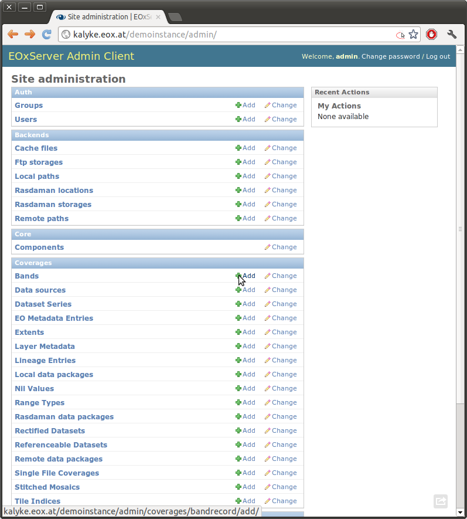
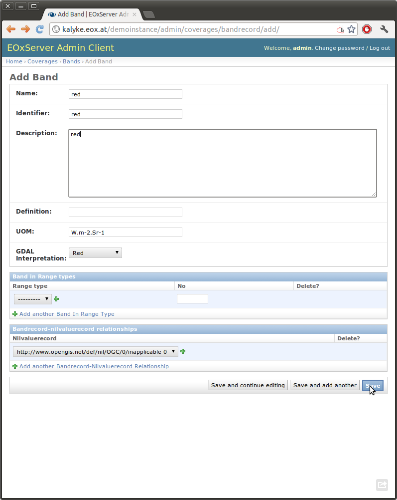
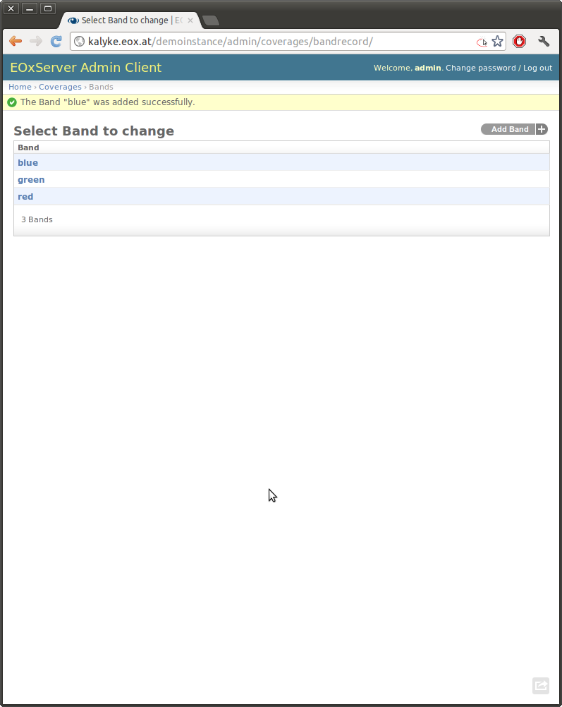
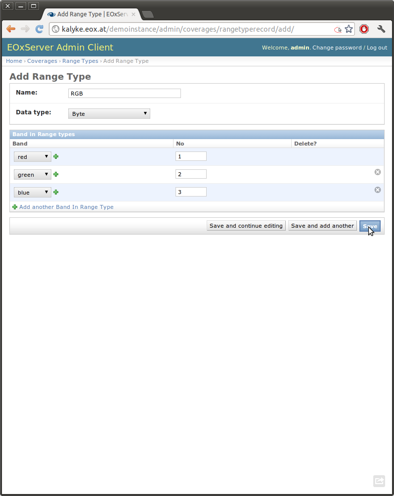

.. EOxServer Operators' Guide
  #-----------------------------------------------------------------------------
  # $Id$
  #
  # Project: EOxServer <http://eoxserver.org>
  # Authors: Stephan Krause <stephan.krause@eox.at>
  #          Stephan Meissl <stephan.meissl@eox.at>
  #
  #-----------------------------------------------------------------------------
  # Copyright (C) 2011 EOX IT Services GmbH
  #
  # Permission is hereby granted, free of charge, to any person obtaining a copy
  # of this software and associated documentation files (the "Software"), to
  # deal in the Software without restriction, including without limitation the
  # rights to use, copy, modify, merge, publish, distribute, sublicense, and/or
  # sell copies of the Software, and to permit persons to whom the Software is
  # furnished to do so, subject to the following conditions:
  #
  # The above copyright notice and this permission notice shall be included in
  # all copies of this Software or works derived from this Software.
  #
  # THE SOFTWARE IS PROVIDED "AS IS", WITHOUT WARRANTY OF ANY KIND, EXPRESS OR
  # IMPLIED, INCLUDING BUT NOT LIMITED TO THE WARRANTIES OF MERCHANTABILITY,
  # FITNESS FOR A PARTICULAR PURPOSE AND NONINFRINGEMENT. IN NO EVENT SHALL THE
  # AUTHORS OR COPYRIGHT HOLDERS BE LIABLE FOR ANY CLAIM, DAMAGES OR OTHER
  # LIABILITY, WHETHER IN AN ACTION OF CONTRACT, TORT OR OTHERWISE, ARISING 
  # FROM, OUT OF OR IN CONNECTION WITH THE SOFTWARE OR THE USE OR OTHER DEALINGS
  # IN THE SOFTWARE.
  #-----------------------------------------------------------------------------

.. _EOxServer Operators' Guide:

EOxServer Operators' Guide
===========================

.. contents:: Table of Contents
    :depth: 3
    :backlinks: top

Basic Concepts
--------------

EOxServer is all about coverages - see the :doc:`basics` for a short
description.

In the language of the OGC Abstract Specification, coverages are mappings from
a domain set that is related to some area of the earth to a range set. So, the
data model for coverages contains information about the structure of the
domain set and of the range set (the so-called Range Type).

In the :ref:`ops_coverages` section below you find more detailed information
about what data and metadata is stored by EOxServer.

The actual data EOxServer deals with can be stored in different ways. These
storage facilities are discussed below in the section on
:ref:`ops_storage_backends`.

Operators have different possibilities to ingest data into the system. Using
the :ref:`ops_admin`, you can edit the contents of the EOxServer database.
Especially for batch processing using the :ref:`ops_cli` may be preferable.

.. _ops_storage_backends:

Storage Backends
----------------

EOxServer supports different kinds of data stores for coverage data:

* as an image file stored on the local file system
* as an image file stored on a remote FTP server
* as a raster array in a `rasdaman <http://www.rasdaman.org>`_ database

These different ways of storing data are called Storage Backends. Internally,
EOxServer uses the term Location as an abstraction for the different ways
access to the data is described. Each storage backend has its own type of
Locations that is described in the following subsections.

Local
~~~~~

A path on the local filesystem is the most straightforward way to define the
location of a resource. You can use relative paths as well as absolute paths.
Please keep in mind that relative paths are interpreted as being relative to
the working directory of the process EOxServer runs in. For Apache processes,
for instance, this is usually the root directory ``/``.

FTP Repositories
~~~~~~~~~~~~~~~~

EOxServer allows to define locations on a remote FTP server. This is useful
if you do not want to transfer a whole large archive to the machine EOxServer
runs on. In that case you can define a remote path that consists of information
about the FTP server and the path relative to the root directory of the
FTP repository.

An FTP Storage record - as it is called in EOxServer - contains the URL of the
server and optional port, username and password entries.

Resources stored on an FTP server are transferred only when they are needed.
There is however a cache for transferred files on the machine EOxServer runs on.

Rasdaman Databases
~~~~~~~~~~~~~~~~~~

The third backend supported at the moment are
`rasdaman <http://www.rasdaman.org>`_ databases. A rasdaman location consists
of rasdaman database connection information and the collection of the
corresponding resource.

The rasdaman storage records contain hostname, port, database name, user and
password entries.

The data is retrieved from the database using the rasdaman GDAL driver (see
:doc:`install` for further information).

.. _ops_coverages:

Coverages
---------

EOxServer coverages fall into three main categories:

* :ref:`ops_rect_ds`
* :ref:`ops_ref_ds`
* :ref:`ops_rect_mosaics`

In addition there is the :ref:`ops_ds_series` type which corresponds to an
inhomogeneous collection of coverages.

.. _ops_range_types:

Range Types
~~~~~~~~~~~

Every coverage has a ramge type that describes the structure of the data.
Each range type has a given data type whereas the following data types are 
supported:

============== ===============
Data Type Name Data Type Value
============== ===============
Unknown        0
Byte           1
UInt16         2
Int16          3
UInt32         4
Int32          5
Float32        6
Float64        7
CInt16         8
CInt32         9
CFloat32       10
CFloat64       11
============== ===============

A range type contains of one or more bands. For each band you may specify a 
name, an identifier and a definition that describes the property measured
(e.g. radiation). Furthermore, you can define nil values for each band (i.e.
values that indicate that there is no measurement at the given position).

This range type metadata is used in the coverage description metadata that is
returned by WCS operations and for configuring WMS layers.

.. _ops_eo_md:

EO Metadata
~~~~~~~~~~~

Earth Observation (EO) metadata records are stored for each EO coverage
and Dataset Series. They contain the acquisition begin and end time as well
as the footprint of the coverage. The footprint is a polygon that describes the
outlines of the area covered by the coverage.

.. _ops_rect_ds:

Rectified Datasets
~~~~~~~~~~~~~~~~~~

Rectified Datasets are EO coverages whose domain set is a rectified grid i.e. 
which are having a regular spacing in projected or geographic CRS. In practice, 
this applies to ortho-rectified satellite data. The rectified grid is described 
by the EPSG SRID of the coordinate reference system, the extent and pixel size 
of the coverage.

Rectified Datasets can be added to Dataset Series and Rectified Stitched
Mosaics.

.. _ops_ref_ds:

Referenceable Datasets
~~~~~~~~~~~~~~~~~~~~~~

Referenceale Datasets are EO coverages whose domain set is a referenceable grid 
i.e. which are not rectified, but are associated with (one or more) coordinate 
transformation which relate the image to a projected or geographic CRS. 
That means that there is some general transformation between the grid cell
coordinates and coordinates in an earth-bound spatial reference system. This
applies for satellite data in its original geometry.

At the moment, EOxServer supports only referenceable datasets that contain
ground control points (GCPs) in the data files. Simple approximative
transformations based on these GCPs are used to generate rectified views on the
data for WMS and to calculate subset bounds for WCS GetCoverage requests. Note
that these transformations can be very inaccurate in comparison to an actual
ortho-rectification of the coverage.

.. _ops_rect_mosaics:

Rectified Stitched Mosaics
~~~~~~~~~~~~~~~~~~~~~~~~~~

Rectified Stitched Mosaics are EO coverages that are composed of a set of
homogeneous Rectified Datasets. That means, the datasets must have the same
range type and their domain sets must be subsets of the same rectified grid.

When creating a Rectified Stitched Mosaic a homogeneous coverage is generated
from the contained Rectified Datasets. Where datasets overlap the most recent
one as indicated by the acquisition timestamps in the EO metadata is shown on
top hiding the others.

.. _ops_ds_series:

Dataset Series
~~~~~~~~~~~~~~

Any Rectified and Referenceable Datasets can be organized in Dataset Series. 
Multiple datasets which are spatially and/or temporally overlapping can be 
organized in a Dataset Series. Furthermore Stitched Mosaics can also be 
organized in Dataset Series.

.. _ops_data:

Data Preparation and Supported Data Formats
-------------------------------------------

EO Coverages consist of raster data and metadata. The way this data is
stored can vary considerably. EOxServer supports a wide range of different
data and metadata formats which are described below.

Raster Data Formats
~~~~~~~~~~~~~~~~~~~

EOxServer uses the `GDAL <http://www.gdal.org>`_ library for raster data
handling. So does `MapServer <http://www.mapserver.org>`_ whose scripting API
(MapScript) is used by EOxServer as well. In principle, any `format supported
by GDAL <http://www.gdal.org/formats_list.html>`_ can be read by EOxServer and
registered in the database.

There is, however, one caveat. Most data formats are composed of bands which
contain the data (e.g. ENVISAT N1, GeoTIFF, JPEG 2000). But some data formats
(notably netCDF and HDF) have a different substructure: subdatasets. At the
moment these data formats are only supported for data output, but not for data
input.

Raster Data Preparation
~~~~~~~~~~~~~~~~~~~~~~~

Usually, raster data does not need to be prepared in a special way to be
ingested into EOxServer.

If the raster data file is structured in subdatasets, though, as is the case
with netCDF and HDF, you will have to convert it to another format. You can use
the ``gdal_translate`` command for that task::

  $ gdal_translate -of <Output Format> <Input File Name> <Output File Name>

You can display the list of possible output formats with::

  $ gdalinfo --formats
  
For automatic registration of datasets, EOxServer relies on the geospatial
metadata stored with the dataset, notably the EPSG ID of the coordinate
reference system and the geospatial extent. In some cases the CRS information
in the dataset does not contain the EPSG code. If you are using the command
line interfaces of EOxServer you can specify an SRID with the ``--default-srid``
option. As an alternative you can try to add the corresponding information to
the dataset, e.g. with::

  $ gdal_translate -a_srs "+init=EPSG:<SRID>" <Input File Name> <Output File Name>

For performance reasons, especially if you are using WMS, you might also
consider to add overviews to the raster data files using the ``gdaladdo``
command (`documentation <http://www.gdal.org/gdaladdo.html>`_). Note however
that this is supported only by a few formats like GeoTIFF and JPEG2000.

Metadata Formats
~~~~~~~~~~~~~~~~

There are two possible ways to store metadata: the first one is to store it
in the data file itself, the second one is to store it in an accompanying
metadata file.

Only a subset of the supported raster data formats are capable of storing
metadata in the data file. Furthermore there are no standards defining
the semantics of the metadata for generic formats like GeoTIFF. For mission
specific formats, however, there are thorough specifications in place.

EOxServer supports reading basic metadata from ENVISAT N1 files and files that
have a similar metadata structure (e.g. a GeoTIFF file with the same metadata
tags).

For other formats metadata files have to be provided. EOxServer supports two
XML-based formats:

* OGC Earth Observation Profile for Observations and Measurements (OGC 10-157r2)
* an EOxServer native format

Here is an example for EO O&M::

    <?xml version="1.0" encoding="ISO-8859-1"?>
    <eop:EarthObservation gml:id="eop_ASA_WSM_1PNDPA20050331_075939_000000552036_00035_16121_0775" xmlns:eop="http://www.opengis.net/eop/2.0" xmlns:gml="http://www.opengis.net/gml/3.2" xmlns:om="http://www.opengis.net/om/2.0">
      <om:phenomenonTime>
        <gml:TimePeriod gml:id="phen_time_ASA_WSM_1PNDPA20050331_075939_000000552036_00035_16121_0775">
          <gml:beginPosition>2005-03-31T07:59:36Z</gml:beginPosition>
          <gml:endPosition>2005-03-31T08:00:36Z</gml:endPosition>
        </gml:TimePeriod>
      </om:phenomenonTime>
      <om:resultTime>
        <gml:TimeInstant gml:id="res_time_ASA_WSM_1PNDPA20050331_075939_000000552036_00035_16121_0775">
          <gml:timePosition>2005-03-31T08:00:36Z</gml:timePosition>
        </gml:TimeInstant>
      </om:resultTime>
      <om:procedure />
      <om:observedProperty />
      <om:featureOfInterest>
        <eop:Footprint gml:id="footprint_ASA_WSM_1PNDPA20050331_075939_000000552036_00035_16121_0775">
          <eop:multiExtentOf>
            <gml:MultiSurface gml:id="multisurface_ASA_WSM_1PNDPA20050331_075939_000000552036_00035_16121_0775" srsName="http://www.opengis.net/def/crs/EPSG/0/4326">
              <gml:surfaceMember>
                <gml:Polygon gml:id="polygon_ASA_WSM_1PNDPA20050331_075939_000000552036_00035_16121_0775">
                  <gml:exterior>
                    <gml:LinearRing>
                      <gml:posList>-33.03902600 22.30175400 -32.53056000 20.09945700 -31.98492200 17.92562200 -35.16690300 16.72760500 -35.73368300 18.97694800 -36.25910700 21.26212300 -33.03902600 22.30175400</gml:posList>
                    </gml:LinearRing>
                  </gml:exterior>
                </gml:Polygon>
              </gml:surfaceMember>
            </gml:MultiSurface>
          </eop:multiExtentOf>
        </eop:Footprint>
      </om:featureOfInterest>
      <om:result />
      <eop:metaDataProperty>
        <eop:EarthObservationMetaData>
          <eop:identifier>ASA_WSM_1PNDPA20050331_075939_000000552036_00035_16121_0775</eop:identifier>
          <eop:acquisitionType>NOMINAL</eop:acquisitionType>
          <eop:status>ARCHIVED</eop:status>
        </eop:EarthObservationMetaData>
      </eop:metaDataProperty>
    </eop:EarthObservation>

The native format has the following structure::

    <Metadata>
        <EOID>some_unique_eoid</EOID>
        <BeginTime>YYYY-MM-DDTHH:MM:SSZ</BeginTime>
        <EndTime>YYYY-MM-DDTHH:MM:SSZ</EndTime>
        <Footprint>
            <Polygon>
                <Exterior>Mandatory - some_pos_list as all-space-delimited Lat Lon pairs (closed polygon i.e. 5 coordinate pairs for a rectangle) in EPSG:4326</Exterior>
                [
                 <Interior>Optional - some_pos_list as all-space-delimited Lat Lon pairs (closed polygon) in EPSG:4326</Interior>
                 ...
                ]
            </Polygon>
        </Footprint>
    </Metadata>

The automatic registration tools for EOxServer (see below under :ref:`ops_cli`)
expect that the metadata file accompanying the data file has the same name with
``.xml`` as extension.

Metadata Preparation
~~~~~~~~~~~~~~~~~~~~

EOxServer provides a tool to extract metadata from ENVISAT N1 files and
convert it to EO O&M format. It can be found under ``tools/gen_envisat_md.py``.
It accepts an input path to an N1 file and stores the resulting XML file under
the same path with the appropriate file name (i.e. replacing the ``.N1``
extension with ``.xml``). Note that EOxServer must be in the Python path and
the environment variable ``DJANGO_SETTINGS_MODULE`` must be set and point to
a properly configured EOxServer instance.

.. _ops_admin:

Admin Client
------------

The Admin Client is accessible via any standard web browser at the path 
/*admin* under the URL your instance is deployed or simply by following the 
*admin* link on the start page. :ref:`EOxServer Deployment` provides more 
details.

Creating a custom Range Type
~~~~~~~~~~~~~~~~~~~~~~~~~~~~

Before registering any data in EOxServer some vital information on the datasets
has to be provided. Detailed information regarding the kind of data stored can
be defined in the Range Type. A Range Type is a collection of bands which
themselves are assigned to a specifig Data Type (see :ref:`ops_range_types`).

A simple standard PNG for example holds 4 bands (RGB + Alpha) each of them able
to store 8 bit data. Therefore the Range Type would have to be defined with four
bands (red, green, blue, alpha) each of them having 'Byte' as Data Type.

In our example we use the reduced MERIS RGB data provided in the autotest
instance. gdalinfo provides us with the most important information:
::

    [...]
    Band 1 Block=541x5 Type=Byte, ColorInterp=Red
    Band 2 Block=541x5 Type=Byte, ColorInterp=Green
    Band 3 Block=541x5 Type=Byte, ColorInterp=Blue

First, we have to define the bands by clicking "add" next to "Bands" in the 
Admin interface. In "Name", "Identifier" and "Description" you can enter the
same content for now. The default "Definition" value for now can be
"http://www.opengis.net/def/property/OGC/0/Radiance". "UOM" stands for "unit of
measurement" which in our case is radiance defined by the value "W.m-2.Sr-1".
For displaying the data correctly it is recommended to assign the respective
value in "GDAL Interpretation". NoData values can be defined by adding a
"Nilvaluerecord". (see screenshot)

.. _fig_admin_app_01_add_band:

.. _fig_admin_app_02_create_band1:

.. _fig_admin_app_03_create_band2:

After adding also the green and blue band we can proceed defining the Range
Type. After providing the new Range Type with a name you will have to assign a
Data Type of all data. In our case we select "Byte". Below we now have to add
our three Bands by clicking on the lowermost "+" icon. The important part here 
is to assign each Band it's respective number ('1' for red and so on). (see
screenshot)

.. _fig_admin_app_04_add_rangetype:

Alternatively we could have started with the Range Type and added each band via 
the "+" icons next to the bands directly.

Linking to a Local Path
~~~~~~~~~~~~~~~~~~~~~~~

Click "Add" on "Local paths" and paste the desired local directory where your
data is. Make sure the system user under which the web server process is 
running, typically apache, has read access.

..
  # Linking to a FTP Storage
  # ~~~~~~~~~~~~~~~~~~~~~~~~
  # TODO

..
  # Linking to a rasdaman Storage
  # ~~~~~~~~~~~~~~~~~~~~~~~~~~~~~
  # TODO

Creating a Data Package
~~~~~~~~~~~~~~~~~~~~~~~

A *Data Package* consists of a GDAL-readable image file and a corresponding
XML metadata file using the WCS 2.0 Earth Observation Application Profile
(EO-WCS).

.. _fig_admin_app_05_data_package:
.. figure:: images/admin_app_05_data_package.png
   :align: center

..
  # Adding a single Rectified Dataset
  # ~~~~~~~~~~~~~~~~~~~~~~~~~~~~~~~~~
  # TODO

Adding Data Sources
~~~~~~~~~~~~~~~~~~~

After adding a Local Path or location (pointing to a single directory, not a
specific file) you can combine this with a search pattern and create a Data
Source. A viable search pattern would be something like "\*.tif" to add all TIFF
files stored in that directory. Please note that in this case, every TIFF needs
a XML file with the exact same name holding the EO-Metadata.

.. _fig_admin_app_06_add_data_source:
.. figure:: images/admin_app_06_add_data_source.png
   :align: center

.. 
  # Creating a Stitched Mosaic
  # ~~~~~~~~~~~~~~~~~~~~~~~~~~
  # TODO

Creating a Dataset Series
~~~~~~~~~~~~~~~~~~~~~~~~~

A Dataset Series can contain any number of EO Coverages i.e. Datasets or 
Stitched Mosaics. A Dataset Series therefore has its own metadata entry with 
respect to the metadata of its containing datasets.

.. _fig_admin_app_07_add_dataset_series:
.. figure:: images/admin_app_07_add_dataset_series.png
   :align: center

.. _ops_cli:

Command Line Tools
------------------

eoxserver-admin.py create_instance
~~~~~~~~~~~~~~~~~~~~~~~~~~~~~~~~~~

The first important command line tool is used for :ref:`Creating an Instance` 
of EOxServer and is explained in the :ref:`Installation` section of this user' 
guide.

eoxs_register_dataset
~~~~~~~~~~~~~~~~~~~~~

Besides this tool EOxServer adds some custom commands to Django's manage.py 
script. The ``eoxs_register_dataset`` command detailed in the :ref:`Data 
Registration` section.

eoxs_add_dataset_series
~~~~~~~~~~~~~~~~~~~~~~~

The ``eoxs_add_dataset_series`` command allows the creation of a dataset series
with initial data sources or coverages included. In it's simplest use case,
only the ``--eoid`` parameter is required, which has to be a valid and not yet
taken identifier for the Dataset Series.

When supplied with the ``--data-sources`` parameter, given data sources will be
added once the Dataset Series is created. When using the ``--data-sources`` it
is highly recommended to also use ``--patterns``, a list of search patterns
which will be used for the data source of the same index. When only one
``--pattern`` is given, it is used for all data sources.

Unless the ``--no-sync`` parameter is given, this also triggers a
synchronization as explained in the chaper :ref:`what_is_sync`. 

Already registered datasets can be automatically added to the Dataset Series by
using the ``--add`` option which takes a list of IDs referencing either
Rectified Datasets, Referenceable Datasets and Rectified Stitched Mosaics.

The optional ``--default-begin-time``, ``--default-end-time`` and
``--default-footprint`` parameters can be used to supply some default metadata
values. Note: once the Dataset Series is synchronized, these values are
overridden.

eoxs_synchronize
~~~~~~~~~~~~~~~~

This command allows to synchronize an EOxServer instance with the file system.

.. _what_is_sync:

What is synchronization?
^^^^^^^^^^^^^^^^^^^^^^^^

In the context of EOxServer, synchronization is the process of updating the
database models for container objects (such as RectifiedStitchedMosaics or
DatasetSeries) according to changes in the file system.

Automatic datasets are deleted from the database, when their data files cannot
be found in the file system. Similar, new datasets will be created when new
files matching the search pattern in the subscripted directories are found.

When datasets are added to or deleted from a container object, the metadata
(e.g the footprint of the features of interest or the time extent of the image)
of the container is also likely to be adjusted. 

Reasons for Synchronization
^^^^^^^^^^^^^^^^^^^^^^^^^^^

There are several occasions, where synchronization is necessary:

 * A file has been added to a folder associated with a container
 * A file from a folder associated with a container has been removed
 * EO Metadata has been changed
 * A regular check for database consistency

HowTo
^^^^^

Synchronization can be triggered by a custom `Django admin command
<https://docs.djangoproject.com/en/dev/ref/django-admin/>`_, called
``eoxs_synchronize``.

To start the synchronization process, navigate to your instances directory and
type:
::

    python manage.py eoxs_synchronize <IDs>

whereas ``<IDs>`` are the coverage/EO IDs of the containers that shall be
synchronized.

Alternatively, with the ``-a`` or ``--all`` option, all container objects in
the database will be synchronized. This option is useful for a daily cron-job,
ensuring the databases consistency with the file system.
::

    python manage.py eoxs_synchronize --all

The synchronization process may take some time, especially when FTP/Rasdaman
storages are used and also depends on the number of synchronized objects.

Performance
-----------

The performance of different EOxServer tasks and services depends heavily on
the hardware infrastructure and the data to be handled. Tests were made for
two typical operator use cases:

* registering a dataset
* generating a mosaic

The tests for registering datasets were performed on a quad-core machine
with 4 GB of RAM and with a SQLite/SpatiaLite database. The test datasets
were 58 IKONOS multispectral (4-band 16-bit), 58 IKONOS panchromatic (1-band
16-bit) and 58 IKONOS pansharpened (3-band 8-bit) scenes in GeoTIFF format with
file sizes ranging between 60 MB and 1.7 GB. The file size did not have any
discernible impact on the time it took to register. The average registration
took about 61 ms, meaning that registering nearly 1000 datasets per minute is
possible.

The generation of mosaics was performed on a virtual machine with one
CPU core allocated and 4 GB of RAM. Yet again, the input data were IKONOS
scenes in GeoTIFF format.

==================== ============= ===== =============== =============== ======== ===============
Datasets             Data Type     Files Input File Size Tiles Generated Time     GB per minute
==================== ============= ===== =============== =============== ======== ===============
IKONOS multispectral 4-band 16-bit 68    8.9 GB          8.819           10 m     0.89 GB
IKONOS panchromatic  1-band 16-bit 68    35.1 GB         126.750         1:05 h   0.54 GB
IKONOS pansharpened  3-band  8-bit 68    52.7 GB         126.750         1:46 h   0.49 GB
==================== ============= ===== =============== =============== ======== ===============

As the results show the file size of the input files has a certain impact on
performance, but the effect seems to level off.

Regarding the performance of the services there are many influence factors:

* the hardware configuration of the machine
* the network connection bandwith
* the database configuration (SQLite or PostGIS)
* the format and size of the raster data files
* the processing steps necessary to fulfill the request (e.g. resampling,
  reprojection)
* the coverage type (processing referenceable grid coverages is considerably
  more expensive than processing rectified grid coverages)
* the setup of IDM components (if any)

For hints on improving performance of the services see :ref:`install_hw`,
:ref:`ops_data` and :ref:`webclient_mapcache`.
