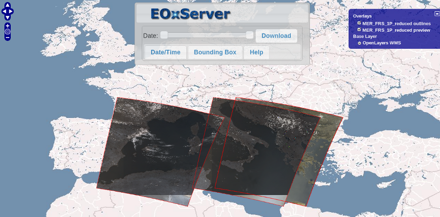

.. Webclient Interface
  #-----------------------------------------------------------------------------
  # $Id$
  #
  # Project: EOxServer <http://eoxserver.org>
  # Authors: Stephan Krause <stephan.krause@eox.at>
  #          Stephan Meissl <stephan.meissl@eox.at>
  #          Fabian Schindler <fabian.schindler@eox.at>
  #
  #-----------------------------------------------------------------------------
  # Copyright (C) 2011 EOX IT Services GmbH
  #
  # Permission is hereby granted, free of charge, to any person obtaining a copy
  # of this software and associated documentation files (the "Software"), to
  # deal in the Software without restriction, including without limitation the
  # rights to use, copy, modify, merge, publish, distribute, sublicense, and/or
  # sell copies of the Software, and to permit persons to whom the Software is
  # furnished to do so, subject to the following conditions:
  #
  # The above copyright notice and this permission notice shall be included in
  # all copies of this Software or works derived from this Software.
  #
  # THE SOFTWARE IS PROVIDED "AS IS", WITHOUT WARRANTY OF ANY KIND, EXPRESS OR
  # IMPLIED, INCLUDING BUT NOT LIMITED TO THE WARRANTIES OF MERCHANTABILITY,
  # FITNESS FOR A PARTICULAR PURPOSE AND NONINFRINGEMENT. IN NO EVENT SHALL THE
  # AUTHORS OR COPYRIGHT HOLDERS BE LIABLE FOR ANY CLAIM, DAMAGES OR OTHER
  # LIABILITY, WHETHER IN AN ACTION OF CONTRACT, TORT OR OTHERWISE, ARISING 
  # FROM, OUT OF OR IN CONNECTION WITH THE SOFTWARE OR THE USE OR OTHER DEALINGS
  # IN THE SOFTWARE.
  #-----------------------------------------------------------------------------

.. _webclient:

The Webclient Interface
=======================

.. contents:: Table of Contents
    :depth: 3
    :backlinks: top

The webclient interface is an application running in the browser and provides a
preview of all Datasets in a specified Dataset Series. It uses an
`OpenLayers <http://openlayers.org/>`_ display to show a WMS view of the
datasets within a map context. The background map tiles are provided by
`OSGeo <http://www.osgeo.org/>`_.

It can further be used to provide a download mechanism for registered datasets.

Enable the Webclient Interface
------------------------------

To enable the webclient interface, several adjustments have to be made to the
instances `settings.py` and `urls.py`.

First off, the `eoxserver.webclient` has to be inserted in the `INSTALLED_APPS`
option of your `settings.py`. As the interface also requires several static
files like style-sheets and script files, the option `STATIC_URL` has to be set
to a path the webserver is able to serve, for example `/static/`. The static
media files are located under `path/to/eoxserver/webclient/static`.

To finally enable the webclient, a proper URL scheme has to be set up in
`urls.py`. The following lines would enable the index and the webclient view
on the URL `www.yourdomain.com/client`.
::

    urlpatterns = patterns('',
        ...
        (r'^client/$', 'eoxserver.webclient.views.index'),
        (r'^client/(.*)', 'eoxserver.webclient.views.webclient'),
        ...
    )

.. _configuration-options-label:

Available configuration options
~~~~~~~~~~~~~~~~~~~~~~~~~~~~~~~

Optionally some configuration settings can be set in the "eoxserver.conf"
config file. These settings have to be put into the "webclient" section:
::

    preview_service=...
    outline_service=...
    preview_url=...
    outline_url=...

The `preview_...` settings defined the settings for the preview layer, showing
an actual RGB representation of the registered datasets, whereas the
`outline_...` settings are used for displaying the footprint of all registered
datasets.

The `..._service` parameter is used to define the service type used to retrieve
the image tiles displayed on the map. Currently, "wms" and "wmts" are supported
and "wms" is the default.

The `..._url` parameter defines the URL of the service providing the image
tiles. This configuration defaults to the configuration given for the
"http_service_url" setting in the "services.owscommon" section.

.. _webclient_mapcache:

Improving Performance with MapCache
~~~~~~~~~~~~~~~~~~~~~~~~~~~~~~~~~~~

WMS offers a very flexible way to view the data; on the other hand performance
is often a problem, especially when dealing with very large data files and
different projections. In order to boost performance, you can use caching
techniques. There are different software packages that provide caching
for WMS services; in this context we present
`MapCache <http://www.mapserver.org/trunk/mapcache/index.html>`_, an open
source tool that is part of the MapServer project.

MapCache supports various tile-based interfaces including the OGC `Web Map
Tile Service <http://www.opengeospatial.org/standards/wmts>`_ (WMTS). We suggest
to use WMTS for caching purposes, as it is a genuine OGC standard whereas the
alternatives (WMS-C, TMS) are mere suggestions witout binding character.

The MapCache sub-package provides an Apache2 HTTP Server module. In order to
install it you must download the latest trunk version of MapServer and change
to the ``mapcache`` subdirectory. There you can build and install the software
in the common way::

  $ ./configure
  $ make
  $ sudo make install
  
For comprehensive installation instructions and alternative setups see the
`MapCache Installation and Configuration
<http://www.mapserver.org/trunk/mapcache/install.html>`_
documentation.

Once you have installed the module you can deploy a MapCache instance. Therefore
you have to add something like the following to your Apache2 configuration::

    <IfModule mapcache_module>
       <Directory /path/to/directory>
          Order Allow,Deny
          Allow from all
       </Directory>
       MapCacheAlias /mapcache "/path/to/directory/mapcache.xml"
    </IfModule>

The XML file the ``MapCacheAlias`` directive points to contains the
configuration of the cache. It specifies the services to be provided, the
data sources, the provided layers, how they are cut into tiles and many other
things. For a complete reference please refer to the `MapCache Configuration
File Docs <http://http://www.mapserver.org/trunk/mapcache/config.html>`_.

Specifically for EOxServer, the data source URL has to be set to the EOxServer
OGC Web Services URL, usually something like
``http://www.example.com/eoxserver_instance/ows``.

As the web client expects input data in the WGS84 coordinate reference system
(EPSG:4326), your MapCache instance must support this CRS. You have to define
a grid using this CRS or use the predefined ``WGS84`` grid. Note that the web
client expects that the map scale increases with the zoom level index. Level 0
is the minimum scale showing the whole covered area (e.g. the whole world for
the predefined ``WGS84`` grid).

If you want to use WMTS with the EOxServer web client you have to define a
tile set for each Recitfied Stitched Mosaic and Dataset Series on your site. The
tile set name must be the same as the CoverageID for Rectified Stitched Mosaics
and the EOID for Dataset Series.

Note that usually a tile will be rendered and written to the cache only when
it is requested, but you can pre-seed the cache using the ``mapcache_seed``
command. Once you have built MapCache, you can find this tool in the
``mapcache/src`` subdirectory of your MapServer directory. For a reference,
see the `MapCache Seeder Docs
<http://www.mapserver.org/trunk/mapcache/seed.html>`_.

Once you have set up a WMTS instance, you can set the EOxServer configuration
parameters ``preview_service`` to ``wmts`` and ``preview_url`` to the URL your
MapCache instance is running under (see also
:ref:`configuration-options-label`).

Using the webclient interface
-----------------------------

The webclient interface can be accessed via the given URL in `urls.py` as
described in the instructions above, whereas the URL `www.yourdomain.com/client` would
open an index view, displaying links to the webclient for every dataset series
registered in the system. To view the webclient for a specific dataset series,
use this URL: `www.yourdomain.com/client/<EOID>` where `<EOID>` is the EO-ID of
the dataset series you want to inspect.

.. _fig_webclient_autotest:

   *The webclient showing the contents of the autotest instance.*

The map can be panned with via mouse dragging or the map-moving buttons in the
upper left of the screen. Alternatively, the arrow keys can be used. The
zoomlevel can be adjusted with the mouse scrolling wheel or the zoom-level
buttons located directly below the pan control buttons.

A click on the small "+" sign on the upper right of the screen reveals the
layer switcher control, where the preview and outline layers of the dataset
series can be switched on or off. By default, the preview layer is switched
off and only the outlines layer is visible.

In the upper center the EOxServer panel can be seen. It is used to select
temporal and spatial subsets for the dataset series.

The slider in the middle is used to select the spatial subset for datasets. The
left slider handle determines the minimum date boundary and the right one the
maximum date boundary for datasets to be displayed.

While moving, the value of the minimum and maximum date can be viewed in the
first tab, "Date/Time". There, it can also be adjusted manually, either as a
text input or via a date-picker widget. For extra fine-grained queries, the
minimum and maximum time values can be adjusted.

Once the date/time has changed from either the slider or the input fields, the
map is updated with the new parameters. The results varies, depending on the
background map viewing service used, as WMTS services simply ignore the time
parameter. If WMS services are configured, only datasets should be visible that
are within the given date/time slice. Please refer to
:ref:`configuration-options-label` for detailed information.

Hidden under the second tab are controls for configuring the bounding box. The
bounding box can either be entered manually with the input fields or drawn on
the map once the "Draw BBOX" function is activated. The bouning box marker and
the input values are tied together, a change on one affects the other.

Unlike the date/time selection, the bounding box has no affect on the preview
or the outlines visible. It is only used for the offering of coverages at the
final Download of data.

The "Download" dialog is shown after the "Download" button in the EOxServer
panel is clicked. It displays a list of all datasets matching the give spatial
and temporal subsets. If no datasets with the given parameters were found, an
error message is shown.

Each coverage can be (de)selected using the checkbox. Only checked datasets
will be downloaded when the "Start Download" button is clicked.

The meaning of the size input fields depends on the actual type of the dataset.
Rectified datasets can be scaled to the given size after all subsets are
applied. Referencable datasets cannot be scaled, and so the size input fields
only hint the overall (not subsetted) size of the raster data.

The multi-select box on the right displays the bands of the range type of the
dataset. Here, the single bands can be (de)selected.

Once the "Start Download" Button is clicked, all selected coverages with the
given spatial and temporal subsets and all given parameters are downloaded. The
actual behavior depends on the used browser, commonly a save file dialog
is displayed.
