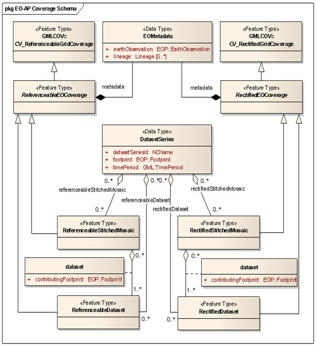
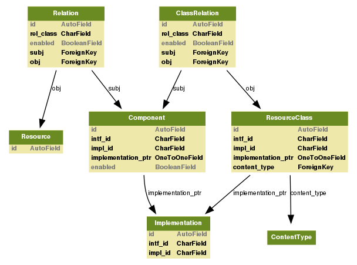
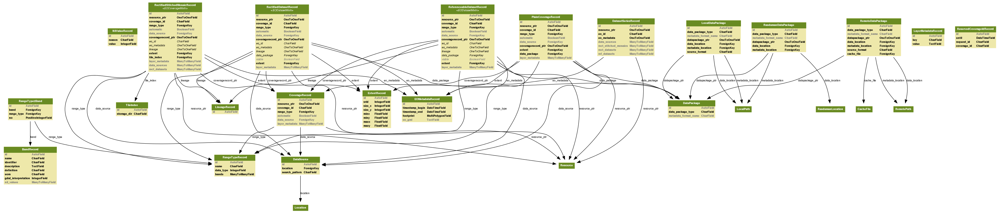
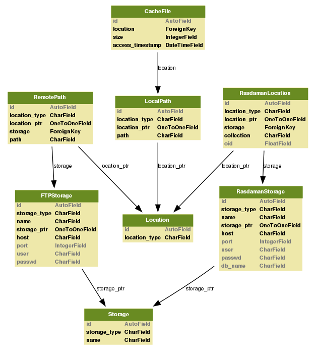
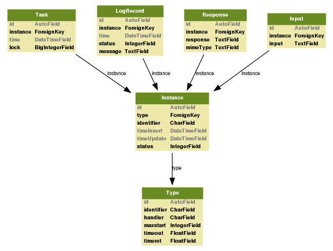

.. Data Model Overview
  #-----------------------------------------------------------------------------
  # $Id$
  #
  # Project: EOxServer <http://eoxserver.org>
  # Authors: Stephan Krause <stephan.krause@eox.at>
  #          Stephan Meissl <stephan.meissl@eox.at>
  #          Martin Paces <martin.paces@eox.at>
  #
  #-----------------------------------------------------------------------------
  # Copyright (C) 2011 EOX IT Services GmbH
  #
  # Permission is hereby granted, free of charge, to any person obtaining a copy
  # of this software and associated documentation files (the "Software"), to
  # deal in the Software without restriction, including without limitation the
  # rights to use, copy, modify, merge, publish, distribute, sublicense, and/or
  # sell copies of the Software, and to permit persons to whom the Software is
  # furnished to do so, subject to the following conditions:
  #
  # The above copyright notice and this permission notice shall be included in
  # all copies of this Software or works derived from this Software.
  #
  # THE SOFTWARE IS PROVIDED "AS IS", WITHOUT WARRANTY OF ANY KIND, EXPRESS OR
  # IMPLIED, INCLUDING BUT NOT LIMITED TO THE WARRANTIES OF MERCHANTABILITY,
  # FITNESS FOR A PARTICULAR PURPOSE AND NONINFRINGEMENT. IN NO EVENT SHALL THE
  # AUTHORS OR COPYRIGHT HOLDERS BE LIABLE FOR ANY CLAIM, DAMAGES OR OTHER
  # LIABILITY, WHETHER IN AN ACTION OF CONTRACT, TORT OR OTHERWISE, ARISING 
  # FROM, OUT OF OR IN CONNECTION WITH THE SOFTWARE OR THE USE OR OTHER DEALINGS
  # IN THE SOFTWARE.
  #-----------------------------------------------------------------------------

.. _Data Model Overview:

Data Model
==========

The core resources in EOxServer are coverages, more precisely GridCoverages. 
The EOxServer data model adopts and strongly relates to the data model from 
EO-WCS (OGC 10-140) as shown below in Figure: ":ref:`fig_eo-wcs_data_model`".

.. _fig_eo-wcs_data_model:

   *EO-WCS Data Model from OGC 10-140*

Core
----

Figure: ":ref:`fig_model_core`" below shows the data model of EOxServer's core.

.. _fig_model_core:

   *EOxServer Data Model for the Core*

.. _Coverages Data Model:

Data Integration Layer
----------------------

Figure: ":ref:`fig_model_coverages`" below shows the data model of the coverage resources.
Note the correlation with the EO-WCS data model as shown above.

.. _fig_model_coverages:

   *EOxServer Data Model for Coverage Resources*

Data Access Layer
-----------------

Figure: ":ref:`fig_model_backends`" below shows the data model of the back-ends layer.

.. _fig_model_backends:

   *EOxServer Data Model for Back-ends*

.. _ATP Data Model:

Task Tracker Data Model 
-----------------------

*Asynchrounous Task Processing* (ATP) uses its own DB model displayed in Figure:
":ref:`fig_model_processes`" to implement the task queueu, store the task inputs
and outputs and track the tasks' status. (For more detail on ATP subsystem see
":ref:`atp_sum`").

.. _fig_model_processes:

   *EOxServer Data Model of ATP Task Tracker*
