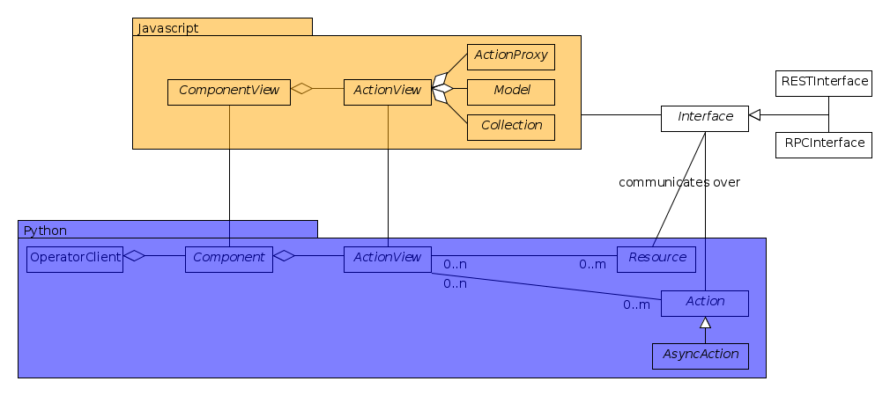
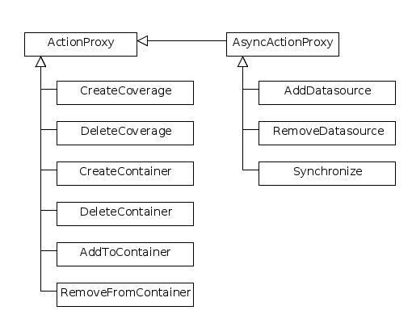

.. RFC 18
  #-----------------------------------------------------------------------------
  # $Id$
  #
  # Project: EOxServer <http://eoxserver.org>
  # Authors: Stephan Krause <stephan.krause@eox.at>
  #          Stephan Meissl <stephan.meissl@eox.at>
  #
  #-----------------------------------------------------------------------------
  # Copyright (C) 2011 EOX IT Services GmbH
  #
  # Permission is hereby granted, free of charge, to any person obtaining a copy
  # of this software and associated documentation files (the "Software"), to
  # deal in the Software without restriction, including without limitation the
  # rights to use, copy, modify, merge, publish, distribute, sublicense, and/or
  # sell copies of the Software, and to permit persons to whom the Software is
  # furnished to do so, subject to the following conditions:
  #
  # The above copyright notice and this permission notice shall be included in
  # all copies of this Software or works derived from this Software.
  #
  # THE SOFTWARE IS PROVIDED "AS IS", WITHOUT WARRANTY OF ANY KIND, EXPRESS OR
  # IMPLIED, INCLUDING BUT NOT LIMITED TO THE WARRANTIES OF MERCHANTABILITY,
  # FITNESS FOR A PARTICULAR PURPOSE AND NONINFRINGEMENT. IN NO EVENT SHALL THE
  # AUTHORS OR COPYRIGHT HOLDERS BE LIABLE FOR ANY CLAIM, DAMAGES OR OTHER
  # LIABILITY, WHETHER IN AN ACTION OF CONTRACT, TORT OR OTHERWISE, ARISING 
  # FROM, OUT OF OR IN CONNECTION WITH THE SOFTWARE OR THE USE OR OTHER DEALINGS
  # IN THE SOFTWARE.
  #-----------------------------------------------------------------------------
.. _rfc_18:

RFC 18: Operator Interface Architecture
=======================================

:Author: Stephan Krause, Fabian Schindler
:Created: 2012-05-08
:Last Edit: $Date$
:Status: PENDING
:Discussion: n/a

The new Operator Interface of EOxServer shall become the main entrance point
for operators who want to administrate an EOxServer instance. The Web UI design
shall focus on usability and support for frequent administration tasks.

The architecture of the Operator Interface shall be modular and extensible in
order to accomodate for future extension and facilitate the maintenance of the
software.

Introduction
------------

At the moment operators have two possibilities to administrate an EOxServer
instance:

* Command Line Tools
* Administration Web Client

The current Administration Client implementation is based on the
:mod:`django.contrib.admin` package and very tightly coupled with the data
model of EOxServer. Whereas this approach has made the development
considerably easier it has several severe drawbacks with respect to usability
and safety of the system:

* the EOxServer data model is fairly complicated and handling it requires a deep
  understanding of the EO-WCS standard as well as Django concepts like model
  inheritance
* certain actions trigger long-running processing tasks on the server side that
  are so far hidden from the operators
* there is no support for asynchronous requests which would be the preferred
  method
* error reporting and status monitoring is only minimal
* the current Admin Interface allows to edit database records without checks
  for consistency; the danger of breaking the system unintentionally is quite
  high

Therefore a new web-based Operator Interface shall be designed that facilitates
the administration tasks. It shall be more usable in the sense that

* the design shall focus on frequent administration tasks rather than the data
  model
* the interface shall provide guidance for operators
* safety shall be increased by checking the consistency of input data and
  organizing the operator actions in a way that precludes unintentionally
  breaking the system
* the operator shall have an overview of the processing tasks going on in the
  backend

From the software point of view, the design shall focus on

* modularity and extensibility, thus preparing for future extensions of
  EOxServer and increasing maintainability
* reusing existing administration code like Coverage Managers
* separation of model, view and controller components where model and controller
  components should be concentrated on the server side and the view on the
  client side

Requirements
------------

The Operator Interface shall support the most frequent tasks for administration.
These include:

* registering a Dataset
* handling the Range Types
* creating a Dataset Series 
* creating a Stitched Mosaic
* deleting a Dataset, Dataset Series or Stitched Mosaic
* adding a Dataset to a Dataset Series or Stitched Mosaic
* removing a Dataset from a Dataset Series or Stitched Mosaic
* creating / adding / removing a data source to/from a Dataset Series or
  Stitched Mosaic 
* viewing the logs
* enabling / disabling of components
* user management

Basic Concepts
--------------

.. _fig_opclient_uml:

   *The Operator Interface structure expressed in a UML class diagram.*

The Operator Interface shall be organized in so called Operator Components.
Operator Components correspond to groups of related packages and modules of
EOxServer or its extensions. The most important components at the moment
are :mod:`eoxserver.core` and :mod:`eoxserver.resources.coverages`.

An Operator Component bundles Actions and Views related to the specific
EOxServer component in the backend.

Actions provide an interface for operators to edit the system configuration
including the data and metadata stored in the database. Most Actions are
related to resources, e.g. coverages or Dataset Series.

In order to make the functionality of these Actions available, the Operator
Interface shall include Action Views. Action Views shall group actions and
information that are closely related to each other.

Each Operator Component may contain several Action Views. They represent a UI
for access to the actions in the backend. Several Actions may be attached to a
single Action View, and Actions may appear in several Action Views.

For example, an Action View might show a list of Rectified Datasets with
basic metadata which allows to create and delete items. Creation and deletion
should each be modeled as Actions on the server side. Another Action View may
show the whole information for a single Rectified Dataset and include
forms and inputs to edit the metadata.

As far as possible, the Action Views should be composed of reusable Widgets.
Widgets consist of HTML and/or JavaScript. The aforementioned list of
Rectified Datasets would be a typical example. It could be used also in the
Dataset Series View.

The core implementation of the Operator Interface shall provide reusable
components to build Widgets of (e.g. lists ...).

The communication between the Action Views and the underlying Actions should
be done via specific Interfaces. One REST-based interface shall be implemented
whiche shall allow to read data and metadata to be displayed, and one
RPC-based interface shall be implemented in order to trigger actions on the
server side.

Detailed Concept Description
----------------------------

In this chapter, the introduced concepts will be elaborated in detail.

Layout of the Operator Interface
~~~~~~~~~~~~~~~~~~~~~~~~~~~~~~~~

The entry point to the operator interface shall be a dashboard-like page. It is
envisaged to present a tab for each Operator Component; this tab shall
contain an overview of the Action Views the Operator Component exhibits.

So, on the client side, each Operator Component should provide:

* A name for the Operator Component that will be shown as caption of the
  tab
* the overview of the Operator Component, which links to the Action Views
* the Action Views
* the Widgets used in the Action Views
* a widget to be displayed on the entry page dashboard (optional)

Each visual representation of the Operator Interface, namely the entry page
dashboard, the Operator Component overview and the Action Views consist of:

* A Django HTML template
* A JavaScript View class
* A python class, entailing arbitrary information and "glue" between the other
  two parts

Only the third part needs to be adjusted when creating a new visual element,
for both the template and the JavaScript class defaults shall help with the
usage.

Action Views and Operator Component overviews should fit into the same basic
layout; customizable CSS should be used for styling. The design of the entry
page design (dashboard) may differ from the design of the sub-pages.

Components and Operator Components
~~~~~~~~~~~~~~~~~~~~~~~~~~~~~~~~~~

Proposed Operator Components:

* User Management
* Configuration Management
* Action Control Center
* Coverages

Action Views
~~~~~~~~~~~~

Proposed Action Views:

* User Management

  * add/delete users
  * edit permissions

* Configuration Management

  * enable and disable components
  * edit configuration settings

* Action Control Center

  * overview over running and completed actions
  * detail views for actions, including status and logs

* Coverages

  * For both Rectified and Referenceable datasets:
  
    * list view including limited update and delete actions
    * detail view including update and delete actions
    * create view to create a new dataset

  * For both Rectified Stitched Mosaics and Dataset Series

    * list view including limited update and delete actions
    * detail view including update, delete and synchronize actions and a
      list display of all contained datasets and data sources including actions
      to insert/remove data sources or datasets
    * create view to create a new dataset

  * list view of Range Types with create, limited update and delete actions
  * detail view of Range Types with update and delete actions and a list
    display of all included Bands with update actions
  * list view of Nil Values with create, update and delete actions

Actions
~~~~~~~

The Actions shall be represented by corresponding Python classes on the
server side. Actions shall be reusable in the sense that they can also be
invoked using a CLI command.

Most Actions are tied to resources like coverages. Resources in that sense
should not be confused with database models. In most cases, a resource will be
tied to a higher-level object: coverage resources for instance shall be tied to
the wrappers defined in :mod:`eoxserver.resources.coverages.wrappers`.

It should be possible to invoke Actions in synchronous and asynchronous mode.
For the asynchronous mode, the existing facilities of the :ref:`atp_sum`
(the :mod:`eoxserver.resources.processes`) shall be adapted and extended. For
this purpose, the :class:`eoxserver.resources.processes.models.LogRecord` shall
receive an additional field ``level``, which specifies the log level the log
record was created with. This allows easy filtering for a minimum log level and
e.g: only show errors and warnings raised during a process.

Every Action shall expose methods to

* validate the parameters
* start the Action and return the ID of that action 
* stop the Action
* check the status of the Action
* check the log messages issued by the Action (maybe this is better implemented
  using the Resource mechanism)

On the client side, Actions are wrapped with ActionProxy objects that offer an
easy API and abstraction for the remote invocation of the Actions methods. For
Asynchronous Action the AsyncActionProxy offers a specialization.

Resources
~~~~~~~~~

Resources are an interface to the data stored as models in the database but
also custom data sources are possible. When applied to models, a resource
allows the create, read, update and delete (CRUD) methods, but this may be
restricted per resource for certain models where the modification of data
requires a more elaborate handling.

On the client side, Resources are wrapped in Models and Collections, which
provide a layer of abstraction and handle the communication with and
consume the REST interface offered by the server. A Model is the abstraction of
a single dataset and a Collection is a set of models in a certain context.

Both Models and Collections offer certain events, to which the client can react
in a suitable manner. This may trigger a synchronization of data with the
server or a (re-)rendering of data on the client in an associated view.
Additionally, models offer validation, which can be used for example to check
if all mandatory fields are set, or inputs are syntactically correct.

Interfaces
~~~~~~~~~~

The following interfaces will be used to exchange data between the server and
the client:

RPC Interface
^^^^^^^^^^^^^

Actions shall be triggered via the RPC Interface. Invocation from the Operator
Interface can be synchronous or asynchronous. Incoming requests from the
Operator Interface shall be dispatched to the respective Actions using a
common mechanism that implements the following workflow:

* validate the parameters conveyed with the request, using the Action interface
* in case they are invalid, return an error code
* in case they are valid, proceed
* queue the Action in the asynchronous processing queue
* return a response that contains the Action ID

Using the Action ID, the Operator Interface can

* check the status of the Action
* view the log messages issued by the Action
* cancel the Action

REST Interface
^^^^^^^^^^^^^^

The REST interface shall be used for resource data retrieval and simple
modification. Usually a REST interface is tightly bound to a database model
and its fields. Thus modification of data via REST should only be possible
in simple situations where there is no dependency tp other resources and no
other synchronization mechanism necessary.

Where the REST interface is not applicable, the RPC interface shall be used.

Directory Structure
~~~~~~~~~~~~~~~~~~~

For the server part, the directory structure of the operator interface follows
the standard guidelines for Django apps (as created with the `django-admin.py
startapp` command):
::

    operator/
    |-- action.py
    |-- common.py
    |-- component.py
    |-- __init__.py
    |-- resource.py
    |-- sites.py
    |-- static
    |   `-- operator
    |       |-- actions.js
    |       |-- actionviews.js
    |       |-- componentviews.js
    |       |-- main.js
    |       |-- router.js
    |       `-- widgets.js
    `-- templates
        `-- operator
            |-- base_actionview.html
            |-- base_component.html
            `-- operatorsite.html

In the templates directory all Django templates are held. It is encouraged to
use the same scheme for all components to be implemented.

The static files are placed in the sub-folder "operator" which serves as a
namespaces for javascript module retrieval. All components shall use an
additional unique subfolder to avoid collision. For example:
"operator/coverages".

################################################################################

Implementation Details
----------------------

In this chapter, the proposed implementation API of components explained.

Implementing Components
~~~~~~~~~~~~~~~~~~~~~~~

To create a component, one simply shall have to subclass the abstract base
class provided by the Operator Interface API. It shall be easily adjustible
by using either a custom JavaScript view class or a different django template.

To further improve the handling of components, several default properties
within the subclass can be used, like title, name, description or others. Of
course default values shall be provided.

Components are registered by the Operator Interface API function
``register()``, which shall be sufficient to append it to the visualized
components.

Example::

    import operatorinterface as operator

    class MyAComponent(operator.Component):
        dependencies = [SomeOtherComponent]
        name = "ComponentA"
        javascript_class = "operator/component/MyAComponentView"

    operator.site.register(MyAComponent)

Implementing Action Views
~~~~~~~~~~~~~~~~~~~~~~~~~

The implementation of action views is very much like the implementation of
components and should follow the same rules concerning JavaScript view classes
and django templates.

Additionally it shall have two fields named ``actions`` and ``resources``, each
is a list of Action or Resource classes.

Example::

    class MyTestActionView(operator.ActionView):
        actions = [MyTestAction]
        resources = [ResourceA, ResourceB]
        name = "mytestactionview"
        javascript_class = "operator/component/MyTestActionView"

Implementing Resources
~~~~~~~~~~~~~~~~~~~~~~

Implementing Resources should be as easy as implementing actions. As with
Actions, Resources are implemented by subclassing the according abstract base
class and providing several options. The only mandatory arguments shall be the
Django model to be externalized, optional are the permissions required for this
resource, maybe means to limit the acces to read-/write-only (maybe coupled
to the provided permissions) and the inc-/exclusion of model fields.

Example::

    class MyResource(ModelResource):
        model = MyModel
        exclude = ( ... )
        include = ( ... )
        permissions = [ ... ]

Implementing Actions
~~~~~~~~~~~~~~~~~~~~

To implement a new Action, it shall be enough to inherit from an abstract base
class and implement the required methods. Once registered the operator
framework shall handle the URL and method registration.

Example::

    class ProgressAction(BaseAction):
        name = "progressaction"
        permissions = [ ... ]
        
        def validate(self, params):
            ...
        
        def start(self):
            ...
        
        def status(self, obj_id):
            ...
        
        def stop(self, obj_id):
            ...
        
        def view_logs(self, obj_id, timeframe=None):
            ...

Access Control
~~~~~~~~~~~~~~

The Operator Interface itself, its Resources and its Actions shall only be
accessible for authorized users. Also, the Interface shall distinguish between
at least two types of users: administrative users and users that only have
reading permissions and are not allowed to alter data. The permissions shall
be able to be set fine-grained, on a per-action or per-resource basis.

It is proposed to use the Django buil-in auth framework and its integrations in
other software frameworks.

Configuration and Registration of Components
~~~~~~~~~~~~~~~~~~~~~~~~~~~~~~~~~~~~~~~~~~~~

On the server side, the Operator Interface is set up similar to the Djangos
built-in Admin Interface. To enable the Operator Interface, its app identifier
has to be inserted in the `INSTALLED_APPS` list setting and its URLs have to be
included in the URLs configuration file.

Also similar to the Admin Interface, the Operator Interface provides an
`autodiscover()` function, which sweeps through all `INSTALLED_APPS`
directories in search of a `operator.py` module, which shall contain the apps
setup of Components, Action Views, Actions and Resources.

Example Component: Coverage Component
-------------------------------------

This chapter explains an the example component to handle all kinds of
interactions concerning coverages, mosaics and dataset series respectively all
types of assorted metadata.

Requirements
~~~~~~~~~~~~

As described earlier, the interactions shall entail creating/updating/deleting
coverages and containers aswell inserting coverages into containers.
Additionally users shall also trigger a synchronization process on rectified
stitched mosaics and dataset series. As this may well be a time-consuming task,
scanning through both the database and the (possibly remote) filesystem, it
shall be handled asynchronously and output status messages.

Last but not least, all coverage metadata shall also be handled, including
geo-spatial, earth observational and raster specific metadata.

The above requirements can be summarized in the following groups:

  * Coverage Handling (also includes geospatial and EO-meta-data as the
    relation is one-to-one)
  * Container Handling (same as above)
  * Range Type Handling (as other more tied meta-data is handled in the other
    sections)

The requirement groups will be implemented as Action Views on the client, using
specific widgets to allow interaction.

Server-Side implementation
~~~~~~~~~~~~~~~~~~~~~~~~~~

The identified requirements have several implications on the server side. First
off the three Action Views need to be declared to implement the three groups of
reqiurements listed above and suited with the needed resources and actions.

Resources
^^^^^^^^^

For simple access to the internally stored data, a list of Resources need to be
defined: one for each coverage/container type, one for range types, bands and
nil values and also for data sources.

For asynchronous tasks, also the running tasks and their logs need to be
exposed as resources.

Actions
^^^^^^^

The actions derived from the requirements can be summarized in the following
list: add coverage to a container, remove a coverage from a container, add a
data source to a container, remove a datasource from a container, manually
start a synchronization process for a container. The first two actions can
likely be handled synchronously as the management overhead is potentially not
as high as with the latter three actions. Thus the introduced actions can be
split into synchronous and asynchronous actions.

Additionally, for creating/deleting coverages and containers is done by using
Actions instead of their Resources, because it involves a higher order of
validation and additional tasks to be done which are too complex and unreliable
if controlled by the server.

Summary
^^^^^^^

The following classes with their according hierarchical structure has been
identified.

+-----------+--------------------+-------------------+-----------------------+
| Component | Action Views       | Resources         | Actions               |
+===========+====================+===================+=======================+
| Coverages | Coverage Handling  | Rect. Coverages   | Add to Container      |
|           |                    +-------------------+-----------------------+
|           |                    | Ref. Coverages    | Remove from Container |
|           |                    +-------------------+-----------------------+
|           |                    | Rect. Mosaics     | Create Coverage       |
|           |                    +-------------------+-----------------------+
|           |                    | Range Types       | Delete Coverage       |
|           |                    +-------------------+-----------------------+
|           |                    | Bands             |                       |
|           |                    +-------------------+-----------------------+
|           |                    | NilValues         |                       |
|           +--------------------+-------------------+-----------------------+
|           | Container Handling | Coverages         | Add Coverage          |
|           |                    +-------------------+-----------------------+
|           |                    | Rect. Mosaics     | Remove Coverage       |
|           |                    +-------------------+-----------------------+
|           |                    | Dataset Series    | Add Datasource        |
|           |                    +-------------------+-----------------------+
|           |                    | Logs              | Remove Datasource     |
|           |                    +-------------------+-----------------------+
|           |                    |                   | Synchronize           |
|           |                    |                   +-----------------------+
|           |                    |                   | Create Container      |
|           |                    |                   +-----------------------+
|           |                    |                   | Delete Container      |
|           +--------------------+-------------------+-----------------------+
|           | RangeType Handling | Range Types       |                       |
|           |                    +-------------------+-----------------------+
|           |                    | Bands             |                       |
|           |                    +-------------------+-----------------------+
|           |                    | NilValues         |                       |
+-----------+--------------------+-------------------+-----------------------+

Client-Side implementation
~~~~~~~~~~~~~~~~~~~~~~~~~~

From the requirements we allready have designed three Action Views, which will
be implemented as Backbone views. Each offered resource from the server will
have a Backbone model/collection counterpart communicating with that interface.
Similarily each action will have a proxy class on the client side.

Views
^^^^^

The hierarchy of the client views can be seen in the following figure.

.. _fig_client_views:
.. figure:: resources/rfc18/client_views.png
   :align: center

   *The client views/widget hierarchy.*

Models/Collection
^^^^^^^^^^^^^^^^^

Each offered resource is encapsulated in a model and collection. The following
figure shows the relation of the model/collection layout:

.. _fig_client_models:
.. figure:: resources/rfc18/client_models.png
   :align: center

   *The models/collection hierarchy on the client.*

ActionProxies
^^^^^^^^^^^^^

For each Action on the server, an ActionProxy has to be instantiated on the
client which handle the communication with the server. For the three Actions
that are running asynchronously, a special ActionProxy subclass is used. The
following figure shows which actions are handled synchronously and which follow
an asynchronous approach.

.. _fig_client_action_proxies:

   *The action proxies used on the client.*

Technologies Used
-----------------

On the server side, the Django framework shall be used to provide the basic
functionality of the Operator Interface including specifically the URL setup,
HTML templating and request dispatching.

To help publishing RESTful resources, the django extension `Django REST
framework <http://django-rest-framework.org/>`_ can be used. It provides a
rather simple, yet customizeable access to database model. It also supports
user authorization as required in the chapter `Access Control`_. The library
is available under the BSD license.

To provide the RPC interface, there are two possibilities. The first is a
wrapped setup of the `SimpleXMLRPCServer module
<http://docs.python.org/library/simplexmlrpcserver.html>`_, which would
represent an abstraction of the XML to the actual entailed data and the
dispatching of registered functions. As the module is already included in the
standard library of recent Python versions, this approach would not impose an
additional dependency. A drawback is the missing user authorization, which has
to be implemented manually. Also, this method is only suitable for XML-RPC,
which is more verbose than its JSON counterpart.

The second option would be to use a django extension framework, e.g
`rpc4django <http://davidfischer.name/rpc4django/>`_. This framework eases the
setup of RPC enabled functions, provides user authorization an is agnostic to
the RPC protocol used (either JSON- or XML-RPC). This library also uses the BSD
license.

On the client side, several JavaScript libraries are required. For DOM
manipulation and several utility functions `jQuery <http://jquery.com/>`_ and
`jQueryUI <http://jqueryui.com/>`_ are used. The libraries are licensed under
the GPL and MIT licenses.

As a general utility library and dependency for other module comes `Underscore
<http://underscorejs.org/>`_. To implement a working MVC layout,
`Backbone <http://backbonejs.org/>`_ is suggested. This library also abstracts
the use of REST resources. Both libraries are distributed under the MIT
license.

For calling RPC functions and parsing the output, the library `rpc.js
<https://github.com/westonruter/json-xml-rpc>`_ is required. It adheres to
either the JSON-RPC or the XML-RPC protocol. The library is dual-licensed under
the MIT and the GPL license.

To display larger amounts of objects and to efficiently manipulate them, the
`SlickGrid <https://github.com/mleibman/SlickGrid>`_ and its integration with
Backbone, `Slickback <https://github.com/teleological/slickback>`_ are used.
The two libraries are both licensed under the MIT license.

For easy management of javascript files in conjunction with other resources the
`requirejs <http://requirejs.org/>`_ framework is included. It provides means
to modularize javascript code and resolve dependencies. The toolset also
includes an optimizer which merges and minimizes all modules into a single
javascript file with no changes to the client code. The framework is published
under both MIT and BSD license.

To avoid incompatibilities and third party server dependencies, all javascript
libraries will be served from the EOxServer static files. This implies that for
the operator client-side libraries no additional software needs to be installed
as EOxServer ships with all requirements.

On the server-side the two packages `rpc4django` and `djangorestframework` need
to be installed for the operator to function. As both libraries can be found on
the Python Package Index (PyPI) the installation procedure using `pip` is
straightforward when both dependencies are added to the EOxServer `setup.py`.

When EOxServer is installed using another technique than `pip` (like using the
RPM or Debian packages), the libraries will likely have to be installed
manually. For this reason they have to be listed in the dependencies page in
the user manual aswell.

+-----------------------+--------+---------+---------------------------------+
| Dependency            | Cat.   | License | Purpose                         |
+=======================+========+=========+=================================+
| Django REST Framework | Server | BSD     | Expose server data via REST     |
+-----------------------+--------+---------+---------------------------------+
| RPC 4 Django          | Server | BSD     | Expose server methods via RPC   |
+-----------------------+--------+---------+---------------------------------+
| jQuery                | Client | GPL/MIT | DOM Manipulation / AJAX Client  |
+-----------------------+--------+---------+---------------------------------+
| UnderscoreJS          | Client | MIT     | General Javascript utilities    |
+-----------------------+--------+---------+---------------------------------+
| BackboneJS            | Client | MIT     | MVC Framework, REST abstraction |
+-----------------------+--------+---------+---------------------------------+
| json-xml-rpc          | Client | GPL/MIT | RPC client                      |
+-----------------------+--------+---------+---------------------------------+
| SlickGrid             | Client | MIT     | Data Grid widget implementation |
+-----------------------+--------+---------+---------------------------------+
| Slickback             | Client | MIT     | SlickGrid to Backbone bridge    |
+-----------------------+--------+---------+---------------------------------+
| requirejs             | Client | MIT/BSD | Modularization and optimization |
+-----------------------+--------+---------+---------------------------------+

Voting History
--------------

N/A

Traceability
------------

:Requirements: N/A
:Tickets: http://eoxserver.org/ticket/4
