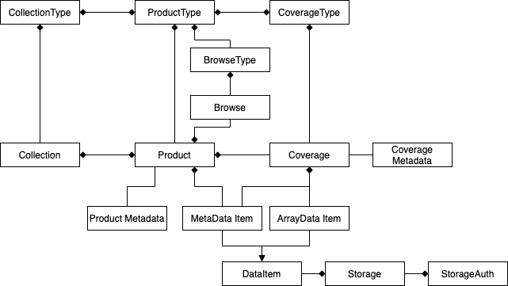

.. Coverages
  #-----------------------------------------------------------------------------
  # $Id$
  #
  # Project: EOxServer <http://eoxserver.org>
  # Authors: Fabian Schindler <fabian.schindler@eox.at>
  #
  #-----------------------------------------------------------------------------
  # Copyright (C) 2020 EOX IT Services GmbH
  #
  # Permission is hereby granted, free of charge, to any person obtaining a
  # copy of this software and associated documentation files (the "Software"),
  # to deal in the Software without restriction, including without limitation
  # the rights to use, copy, modify, merge, publish, distribute, sublicense,
  # and/or sell copies of the Software, and to permit persons to whom the
  # Software is furnished to do so, subject to the following conditions:
  #
  # The above copyright notice and this permission notice shall be included in
  # all copies of this Software or works derived from this Software.
  #
  # THE SOFTWARE IS PROVIDED "AS IS", WITHOUT WARRANTY OF ANY KIND, EXPRESS OR
  # IMPLIED, INCLUDING BUT NOT LIMITED TO THE WARRANTIES OF MERCHANTABILITY,
  # FITNESS FOR A PARTICULAR PURPOSE AND NONINFRINGEMENT. IN NO EVENT SHALL THE
  # AUTHORS OR COPYRIGHT HOLDERS BE LIABLE FOR ANY CLAIM, DAMAGES OR OTHER
  # LIABILITY, WHETHER IN AN ACTION OF CONTRACT, TORT OR OTHERWISE, ARISING
  # FROM, OUT OF OR IN CONNECTION WITH THE SOFTWARE OR THE USE OR OTHER
  # DEALINGS IN THE SOFTWARE.
  #-----------------------------------------------------------------------------

.. _Coverages:

Coverages
=========

This document describes the data model layout of the coverages, the internal
structure of earth observation products, collections and data files. It also
shows how these models can be interacted with via the command line interfaces.

Data model
----------

The data model is loosely based on the OGC coverages data models, especially
with the EO Application Profile for WCS 2.0.

Coverage Type
~~~~~~~~~~~~~

The coverage type describes the internal structure of coverages of a specific
type. The coverage type is comprised of a list of field types that define the
structure and metadata of a specific field of Data, called the Field Type.

The coverage type has a unique name to allow its identification.

Product Type
~~~~~~~~~~~~

The product type model allows to define the structure of products by limiting
the coverage types each coverage is allowed to have for products of this
product type.

Additionally, each Product Type can be associated with a number of
`Browse Type`_ and `Mask Type`_ that define the masks and browses that products
of that type are allowed to have.

Browse Type
...........

A browse type defines a typical visual representation of a product. For this
purpose, it allows to define expression, scaling ranges and nodata values to
generate that representation (browse).

A browse type can either define a single output band (grey), three output bands
(RGB) or four output bands (RGBA).

Expressions must follow Python syntax rules but can only contain simple
arithmetic expressions. All identifiers must be names of field types that are
linked to coverage types in the list of allowed coverage types of the
referenced product type.

Mask Type
.........

These type models define what polygon masks can be linked to products of that
product type and whether the masks define areas of validity or invalidity.

Collection Type
~~~~~~~~~~~~~~~

These type models allow to define the shape of collections by allowing to limit
the product types and coverage types of product and coverages that can be added
to collections of their respective collection types.

EOObject
~~~~~~~~

This is the base model class for uniquely identifier geospatial objects.
EOObject provides the fields ``identifier`` (mandatory and unique), the
``footprint`` (its geometry) and its temporal distribution: ``begin_time`` and
``end_time``.

All objects inheriting from EOObject share a common pool of identifier. Thus,
it is, for example, not possible for a collection to have the same identifier
as a product or coverage.

.. _Grid Model:

Grid
~~~~

A grid defines a regularly spaced grid comprised of up to four axes. Each axis
can either be of spatial, temporal, evelation or other type. For each defined
axis, the regular offset value must be specified.

Each grid is associated with a coordinate reference system.

A grid can be named, making it easier to manage.

A grid does *not* provide an actual location or area, this information can only
be obtained with a Grid Fixture in conjunction with a grid.

.. _Mosaic Model:

Mosaic
~~~~~~

This model is a collection of homogenenous coverages, all sharing the same
coverage type and grid. This allows to access the mosaic as if it were a single
coverage by combinig the data from all its comprising elements.

.. _Coverage Model:

Coverage
~~~~~~~~

A coverage is an n-dimensional raster data set comprised of several fields.

A coverage is linked to at least one ArrayDataItem, a reference to the actual
raster data.

TODO: rel OGC coverage

.. _Product Model:

Product
~~~~~~~

A product is a sort of collection of geospatially and temporally very close
objects.

A product can combine multiple coverages which cover the same are but cannot be
combined to a single coverage because of different resolutions.

In some cases, coverages are not necessary at all, and just provide data items
for a binary download and browses for previewing.

.. _Browse Model:

Browse
......

A browse is always associated with a product and serves as a preview to the
actual data. Browses are materialized files that are either pre-generated or
can be generated from the coverage data.

.. _Mask Model:

Mask
....

Masks allow to specify regions in products for some kind of flag for example
validity. Each mask is linked to a `Mask Type`_.

.. _Collection Model:

Collection
~~~~~~~~~~

Multiple coverages and products can be grouped in a collection. This
relationship is many-to-many, so each product/coverage can be inserted into
multiple collections.

When a collection is linked to a `Collection Type`_ only Products and Coverages
whose types are of the set of allowed coverage/product types can be inserted.

Command Line Interfaces
-----------------------

The following command line interfaces can be executed via the ``manage.py``
utility of the instance. All commands are related to one of the models above
and use sub-commands for specific tasks.

.. _cmd-coveragetype:

coveragetype
  This command manages `Coverage Type`_ models and allows to inspect the
  currently available ones.

  create
    Creates a new Coverage Type with specifications from the parameters.

    name
      the name of the Coverage type to create

    --field-type
      add a new field type to the definition. Must be the five parameters:
      ``identifier``, ``description``, ``definition``, ``unit-of-measure``,
      and ``wavelength``. Can be used multiple times to add more than one
      field.

    TODO: example

  import
    imports one or more Coverage Type definition from JSON files.

    locations*
      a list of filenames to import definitions from

    --in, -i
      read from ``stdin`` instead from a file

    TODO: show definition, example

  delete
    deletes a Coverage Type

    name
      the name of the Coverage Type to delete

    --force, -f
      delete the Coverage Type, even if it is still in use. This cascades and
      deletes all Coverages of that type as well.

  list
    lists the stored Coverage Types

    --no-detail
      disable the printing of details of the coverage type.

.. _cmd-producttype:

producttype
  This command manages `Product Type`_ models. It provides the following
  sub-commands:

  create
    creates a new Product Type.

    name
      the name of the Product Type to create

    --coverage-type
      the Coverage Type name to add to this product type. Can be specified
      multiple times.
    --mask-type
      the name of a to be created mask type.
    --validity-mask-type
      the name of a to be created validity mask type.
    --browse-type
      the name of a to be created Browse type. It is recommended to use
      ``browsetype create`` instead.

  delete
    deletes a Product Type

    name
      the name of the Product Type to delete

  list
    lists all available Product Types

    --no-detail
      disable the printing of details of the product type.

.. _cmd-browsetype:

browsetype
  This command allows to create, delete and list `Browse Type`_ models. Since
  Browse Types are always associated with a Product Type the first argument is
  always the name of a Product Type.

  create
    creates a new Browse Type for a Product Type. Valid field names for the
    ``--red``, ``--green``, ``--blue``, and ``--alpha`` parameters are the
    names from the field names of the linked Coverage Types of the associated
    Product Type.

    product_type_name
      the Product Type to create the Browse Type for
    [browse_type_name]
      the name of the Browse Type. Can be omitted, to define the default Browse
      Type.

    --red, --grey, -r
      the field name or mathemathical expression to use as the red output band
      (or grey, if used for a single band output).
    --green, -g
      the field name or mathemathical expression to use as the green output
      band.
    --blue, -b
      the field name or mathemathical expression to use as the blue output
      band.
    --alpha, -a
      the field name or mathemathical expression to use as the green output
      band.
    --red-range, --grey-range
      the low and high border of values to apply a linear stretch for the red
      output band.
    --green-range
      the low and high border of values to apply a linear stretch for the green
      output band.
    --blue-range
      the low and high border of values to apply a linear stretch for the blue
      output band.
    --alpha-range
      the low and high border of values to apply a linear stretch for the alpha
      output band.
    --red-nodata, --alpha-nodata
      the nodata value for the red output band. This is applied after the
      stretch and will result in transparent pixels for this value.
    --green-nodata
      the nodata value for the green output band. This is applied after the
      stretch and will result in transparent pixels for this value.
    --blue-nodata
      the nodata value for the blue output band. This is applied after the
      stretch and will result in transparent pixels for this value.
    --alpha-nodata
      the nodata value for the alpha output band. This is applied after the
      stretch and will result in transparent pixels for this value.

  delete
    deletes a no longer needed Browse Type.

    product_type_name
      the Product Type to delete the Browse Type from
    [browse_type_name]
      the name of the Browse Type to delete

  list
    lists all Browse Types for a given Product Type.

    product_type_name
      the Product Type to list the Browse Types for

.. _cmd-masktype:

masktype
  This command allows to create, delete and list `Mask Type`_ models. Since
  Mask Types are always associated with a Product Type the first argument is
  always the name of a Product Type. The sub-commands are in detail:

  create
    creates a new Mask Type for a Product Type

    product_type_name
      the Product Type to create the Mask Type for
    mask_type_name
      the Mask Type name to create

    --validity
      whether this mask denotes valid or invalid values. By default, it uses
      invalidity.

  delete
    deletes a Mask Type.

    product_type_name
      the Product Type to delete the Mask Type from
    mask_type_name
      the Mask Type name to delete

  list
    lists all Mask Types for a given Product Type.

    product_type_name
      the Product Type to list the Mask Type of

.. _cmd-collectiontype:

collectiontype
  This command manages `Collection Type`_ models using the following
  sub-commands:

  create
    creates a new Collection Type.

    name
      the name of the Collection Type

    --coverage-type, -c
      the name of an existing Coverage Type, that shall be linked to this
      Collection Type. Only Coverages can be inserted into Collection when
      the Coverages Type is part of the Collections Type.

    --product-type, -p
      the name of an existing Product Type, that shall be linked to this
      Collection Type. Only Products can be inserted into Collection when
      the Product Type is part of the Collections Type.

  delete
    deletes a Collection Type.

    name
      the name of the Collection Type to delete

    --force, -f
      forces the deletion of all still existing Collections using this
      Collection Type.

  list
    lists all available Collection Types.

    --no-detail
      Disable the printing of details of the Collection types.

.. _cmd-grid:

grid
  This command allows to create and delete named `Grid Model`_ instances.

  create
    this creates a Grid.

    name
      the name of the Grid to create
    coordinate_reference_system
      the definition of the coordinate reference system. Either an integer
      (the EPSG code), or the URL, WKT or XML definiton.

    The following parameters can be used up to four times in order to define
    multiple axes.

    --name, --axis-name, -n
      the name of the n-th axis to add to the Grid.
    --type, --axis-type, -t
      the type of the n-th axis to add to the Grid.
    --offset, --axis-offset, -o
      the fixed axis offset step of the n-th axis to add to the Grid.

  delete
    deletes a Grid.

    name
      the name of the Grid to delete.

.. _cmd-coverage:

coverage
  this command allows the registration and deregistration of `Coverage Model`_
  instances.

  register
    this sub-command registers a Coverage.

    --data, -d
      this specifies a location for raster data. Multiple values can be used to
      denote that the data resides on a storage. If used in that way the first
      value can also be the name of a named storage.
      This parameter can be used multiple times, when the raster data is split
      into multiple files.
    --meta-data, -m
      similarly to the ``--data`` parameter, this parameter denotes a reference
      to meta-data. The same rules as for the ``--data`` parameter also apply
      here.
    --type, --coverage-type, -t
      specify the `Coverage Type`_ for this Coverage. By default no Coverage
      Type is used.
    --grid, -g
      specify the named `Grid Model`_ to use. By default an anonymous Grid is
      used with the CRS of the raster data files.
    --size, -s
      specifies the size of the Coverage. This overrides the size extracted
      from the metadata/data. Must specify the size for each axis of the Grid.
    --origin, -o
      overrides the origin of the Coverage. Must provide a value for each axis
      of the Grid.
    --footprint, -f
      overrides the geographical footprint of the Coverage. Must be a valid WKT
      geometry.
    --footprint-from-extent
      The footprint polygon shall be calculated from the Coverages extent.
    --identifier, -i
      override the Coverages identifier.
    --identifier-template
      allows the construction of the final identifier from a template.
      Substitution values are passed in from the extracted metadata. e.g:
      ``{identifer}__B01``.
    --begin-time, -b
      override the begin timestamp of the Coverage. Must be a valid ISO 8601
      datetime string.
    --end-time, -e
      override the end timestamp of the Coverage. Must be a valid ISO 8601
      datetime string.
    --product, --product-identifier, -p
      specify the Product identifier this Coverage shall be associated with.
      The Product must already be registered.
    --collection, --collection-identifier, -c
      specify the Collection identifier this Coverage shall be inserted into.
      The Collection must already exist.
    --replace, -r
      replace an already existing Coverage with the same identifier.
    --use-subdatasets, --subdatasets
      specify to interpret colons in the filename as subdataset specifiers.
    --print-identifier
      this switch prints the final identifier (after metadata extraction and
      potential templating) to stdout upon successful registration.

  deregister
    this sub-command de-registers the Coverage with the provided identifier.

    identifier
      the Coverages identifier

    --not-refresh-collections
      this command will update all Collections metadata (footprint, begin-/end
      time) unless this switch is set.

    --all, -a
      When this flag is set, all the Coverages are selected to be derigesterd.

.. _cmd-product:

product
  this command manages `Product Model`_ instances.

  register
    this sub-command registers products.

    --identifier, -i
      override the Product identifier.
    --identifier-template
      allows the construction of the final identifier
      from a template. Substitution values are passed in from the extracted
      metadata. e.g: ``{identifer}__B01``.
    --footprint
      overrides the geographical footprint of the Product. Must be a valid WKT
      geometry.
    --begin-time
      override the begin timestamp of the Product. Must be a valid ISO 8601
      datetime string.
    --end-time
      override the end timestamp of the Product. Must be a valid ISO 8601
      datetime string.
    --set, -s
      sets a specific metadata value for that product. This
      parameter always uses two values: the name of the parameter key
      and its value.
      TODO: possible metadata keys to set
    --metadata-file
      adds a metadata file to the product. As with file
      links for Coverages, the product file can be located on a storage. For
      these cases, multiple values can be used to specify the chain of
      locations.
    --type, --product-type, -t
      specify the `Product Type`_ for this Product. By default no Product Type
      is used.
    --mask, -m
      specify a mask file to be added to this product. Must be two values:
      the masks name and its file location.
    --mask-geomety, -g
      specify a mask using its geometry directly. Must be two values: the masks
      name and its WKT geometry representation.
    --no-extended-metadata
      when this flag is set, only the basic metadata (identifier, footprint,
      begin- and end-time) is stored.
    --no-masks
      when this flag is set, no masks will be discovered.
    --no-browses
      when this flag is set, no browses will be discovered.
    --no-metadata
      when this flag is set, no metadata files will be discovered.
    --package
      specify the main data package for this Product.
    --collection, --collection-identifier, -c
      specify the Collection identifier this Product shall be inserted into.
      The Collection must already exist.
    --replace
      replace an already existing Product with the same identifier.
    --print-identifier
      this switch prints the final identifier (after metadata extraction and
      potential templating) to stdout upon successful registration.

  deregister
    deregisters a Product.

    identifier
      the identifier of the Product to deregister.

    --all, -a
      When this flag is set, all the Coverages are selected to be derigesterd.

  discover
    print the contents of the main package file of a Product.

    identifier
      the identifier of the Product to discover.

    [pattern]
      a filename glob pattern to filter the resulting filenames

.. _cmd-browse:

browse
  this command allows to manage `Browse Model`_ instances of a `Product
  Model`_.

  register
    this sub-command registers a Browse to a Product.

    identifier
      the Product identifier to register the Browse for.
    location
      the storage location of the Browse.

    --type
      the Browse Type name of that Browse.

  generate
    TODO

  deregister
    TODO

.. _cmd-mask:

mask
  this command allows to manage `Mask Model`_ instances of a `Product Model`_.

  register
    registers a Mask for a Product.

    identifier
      the Product identifier to register the Mask for.

    --type
      the Mask Type name of that Mask.
    --location
      the storage location of the Mask.
    --geometry
      the inline WKT geometry for the mask.

  deregister_parser
    deregisters a Mask from a Product

    identifier
      the Product identifier to deregister the Mask from.

.. _cmd-collection:

collection
  this command manages `Collection Model`_ instances. As usual, it
  uses sub-commands to allow fine control over the specific aspects
  and tasks of a Collection.

  create
    creates a new Collection.

    identifier
      the identifier for the new Collection.

    --type, -t
      specify a Collection Type for this new Collection.
    --grid, -g
      specify a Grid for this Collection.
    --set, -s
      set or override Collection metadata.
      TODO: what keys?

  delete
    this sub-command deletes a Collection.

    identifier
      the identifier of the Collection to delete

    --all, -a
      When this flag is set, all the collections are selected to be derigesterd.

  insert
    with this sub-command one or more `Coverage Model`_ instances
    or `Product Model`_ instances can be inserted into the collection. This
    command checks whether the to be inserted objects are of the allowed
    types when a Collection Type is set for this Collection.

    identifier
      the identifier of the Collection to insert objects into.

    object_identifiers+
      the list of object identifiers (either Products or Coverages) to insert
      into the Collection.

  exclude
    this command allows to remove one or more objects from a collection.

    identifier
      the identifier of the Collection to exclude objects from.

    object_identifiers+
      the list of object identifiers (either Products or Coverages) to exclude
      from the Collection.

  purge
    this command purges all Coverages and Products from this Collection,
    leaving it effectively empty.

    TODO: not yet implemented

  summary
    collects metadata from all entailed Products and Coverages to generate a
    summary that is stored in the Collection.
    This allows a quick overview of the metadata ranges and specific
    values of all objects in the collection.

    identifier
      the Collection identifier to generate the summary for

    --products/--no-products
      whether or not to generate a Product metadata summary.
    --coverages/--no-coverages
      whether or not to generate a Coverage metadata summary.

.. _cmd-mosaic:

mosaic
  this command manages `Mosaic Model`_ instances with a variety of
  sub-commands.

  create
    creates a new Mosaic.

    identifier
      the identifier of the Mosaic to create.

    --type, -t
      the Coverage Type name for the Mosaic to create.
    --grid, -g
      the Grid to use for the Mosaic.

  delete
    deletes a Mosaic.

    identifier
      the identifier of the Mosaic to delete.

  insert
    insert one or more Coverages into the Mosaic.

    identifier
      the identifier of the Mosaic to insert Coverages into.

    coverage_identifiers+
      the Coverage identifiers to insert into the Mosaic.

  exclude
    exclude one or more Coverages from the Mosaic.

    identifier
      the identifier of the Mosaic to exclude Coverages from.

    coverage_identifiers+
      the Coverage identifiers to exclude from the Mosaic.

  refresh
    refresh the summary metadata of the Mosaic.

    identifier
      the identifier of the Mosaic to generate the metadata.

  purge
    TODO not implemented

.. _cmd-id:

id
  this command allows to introspect the contents of the instances database.

  check
    this subcommand allows to check whether or not an object is registered. The
    return value of this command indicates whether such an object exists.

    identifiers+
      the identifier(s) to check for existence.

    --type, -t
      limit the check to the given object type (i.e: ``Coverage``,
      ``Product``, ``Collection``, or ``Mosaic``). By default the search is for
      any ``EOObject``.

  list
    this command lists the contents of the database and prints the objects on
    on the terminal. Filters can be applied to limit the search.

    identifiers*
      limit the output to the given identifiers.

    --type, -t
      limit the listing to the given object type (i.e: ``Coverage``,
      ``Product``, ``Collection``, or ``Mosaic``). By default the search is for
      any ``EOObject``.
    --recursive, -r
      do a recursive lookup into the given collections.
    --suppress-type, -s
      when printing an object, suppress the type and only print the identifier
    --collection, -c
      limit the search to this collection only. Can be passed multiple times to
      search across multiple collections.

.. _cmd-mapcache:

mapcache
  this command allows to generate an index database to be used for mapcache
  time dimensions.

  sync
    this sub-command synchronizes a mapcache index database. The output will be
    written to the ``<collection-name>.sqlite`` files for each available
    collection in the current working directory.

    The schema of the database will be the following:

    .. code-block:: sql

        CREATE TABLE "time" (
            "start_time" timestamp with time zone NOT NULL,
            "end_time" timestamp with time zone NOT NULL,
            "minx" double precision NOT NULL,
            "miny" double precision NOT NULL,
            "maxx" double precision NOT NULL,
            "maxy" double precision NOT NULL
        )

    --force, -f
      force the re-generation of the index files.
    --unique-times, -u
      force unique time entries. This combines the extent of all objects with
      overlapping time spans.
    --no-index
      this flag prohibits the creation of an internal database index.

.. _cmd-stac:

stac
  This command allows to register Products and their related data from `STAC
  Items`_.

  register
    this sub-command registers a STAC Item as a Product and its raster data as
    Coverages.

    --in, -i              Read the STAC Item from stdin instead from a file.
    --type TYPE_NAME, --product-type TYPE_NAME, -t TYPE_NAME
      The name of the product type to associate the product with. Optional.
    --replace, -r
      Optional. If the product with the given identifier already exists,
      replace it. Without this flag, this would result in an error.

  types
    this sub-command extracts all the relevant information to generate Product
    Types, Coverage Types and their related types to allow a subsequent
    registration.

    --in, -i
      read the STAC Item from stdin instead from a file.
    --type TYPE_NAME, --product-type TYPE_NAME, -t TYPE_NAME
      the name of the new product type. Optional.
