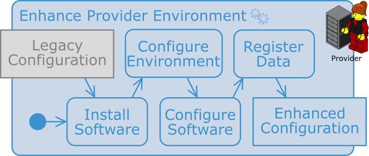
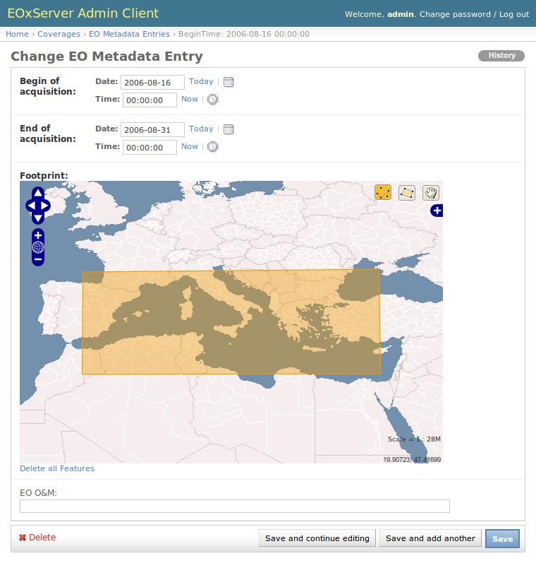

.. Global Use Case
  #-----------------------------------------------------------------------------
  # $Id$
  #
  # Project: EOxServer <http://eoxserver.org>
  # Authors: Stephan Krause <stephan.krause@eox.at>
  #          Stephan Meissl <stephan.meissl@eox.at>
  #
  #-----------------------------------------------------------------------------
  # Copyright (C) 2011 EOX IT Services GmbH
  #
  # Permission is hereby granted, free of charge, to any person obtaining a copy
  # of this software and associated documentation files (the "Software"), to
  # deal in the Software without restriction, including without limitation the
  # rights to use, copy, modify, merge, publish, distribute, sublicense, and/or
  # sell copies of the Software, and to permit persons to whom the Software is
  # furnished to do so, subject to the following conditions:
  #
  # The above copyright notice and this permission notice shall be included in
  # all copies of this Software or works derived from this Software.
  #
  # THE SOFTWARE IS PROVIDED "AS IS", WITHOUT WARRANTY OF ANY KIND, EXPRESS OR
  # IMPLIED, INCLUDING BUT NOT LIMITED TO THE WARRANTIES OF MERCHANTABILITY,
  # FITNESS FOR A PARTICULAR PURPOSE AND NONINFRINGEMENT. IN NO EVENT SHALL THE
  # AUTHORS OR COPYRIGHT HOLDERS BE LIABLE FOR ANY CLAIM, DAMAGES OR OTHER
  # LIABILITY, WHETHER IN AN ACTION OF CONTRACT, TORT OR OTHERWISE, ARISING 
  # FROM, OUT OF OR IN CONNECTION WITH THE SOFTWARE OR THE USE OR OTHER DEALINGS
  # IN THE SOFTWARE.
  #-----------------------------------------------------------------------------

.. index::
   single: Global Use Case
   single: Use Case

.. _Global Use Case:

Global Use Case
===============

.. contents:: Table of Contents
    :depth: 3
    :backlinks: top

This section describes the global Use Case of EOxServer including concrete 
usage scenarios as examples.

Figure: ":ref:`fig_global_use_case_1`" introduces the involved parties in this 
global Use Case.

.. _fig_global_use_case_1:
.. figure:: images/Global_Use_Case.png
   :align: center

   *Parties involved in the EOxServer Global Use Case*

On the one side there is a provider of Earth Observation (EO) data. The 
provider has a possibly huge, in terms of storage size, archive of EO data and 
wants to provide this data to users. Of course the data provision has to follow 
certain constraints and requirements like technical, managerial, or security 
frame conditions but in general the provider wants to reach as many users as 
possible with minimal efforts.

On the other side there is a user of EO data. The user has the need of certain 
EO data as input to some processing which varies from simple viewing to complex 
data analysis and generation of derived data. The user wants to obtain the 
needed EO data as easily as possible which includes finding the right data from 
the right provider at the right time at the right location and retrieving it in 
the right representation e.g. format.

Already from this simple constellation the need for standardized interfaces is 
evident. Thus EOxServer implements the open publicly available interface 
standards defined by the Open Geospatial Consortium (OGC). In particular 
EOxServer contains an implementation of the Web Coverage Service (WCS) 
including its Earth Observation Application Profile (EO-WCS) and the Web Map 
Service (WMS) again including its EO extension (EO-WMS).

These interface standards have been chosen to support the new paradigm of 
"zooming to the data". This means looking at previews of the data rather than 
searching in a catalogue in order to find the right data. WMS together with its 
EO extension is used for the previews whereas WCS with its EO extensions is 
used to download the previously viewed data and metadata. Of course a provider 
is free to operate a catalogue in parallel including references to the EO-WMS 
and EO-WCS.

The EOxServer software stack is a collection of Open Source Software designed 
to enhance a wide range of legacy systems of EO data archives with controlled 
Web-based access ("online data access") with minimal efforts for the provider. 
The user not only significantly benefits from the provider's enhanced online 
data access but also from the client functionalities included in the EOxServer 
software stack.

In particular the EOxServer software stack provides the following features:

* easy to install
* simple yet powerful web interface for data registration for the provider
* standardized way to access geographic data i.e. via EO-WMS and EO-WCS
* download of subsets of data
* on the fly re-projection, re-sampling, and format conversion
* visual preview of data
* integrated usage of EO-WMS and EO-WCS to view and download the same data
* intelligent automated handling of EO collections and mosaics
* homogeneous way to access different data, metadata, and packaging formats
* homogeneous access to different storage systems i.e. file system, ftp, and 
  rasdaman

These features result in the general benefit for the provider to be more 
attractive to the user.

The following sub-sections provide details from the provider and user point of 
view highlighting the possible usage of the EOxServer software stack.

The General *Provider* View
---------------------------

The provider operates an archive of EO data with different ways of actually 
accessing the data. For simplicity let's assume the data archived in this 
legacy system can be accessed in two ways. First there is the local access 
directly to the file system via operating system capabilities. Second there is 
an online access by exposing certain directories via FTP.

The EOxServer software stack acts as a middle-ware layer in front of the legacy 
archive system that expands the offered functionality and thus widens the 
potential user or customer base. The additional functionality compared to plain 
FTP access includes:

* interoperable online access via a standard interface defined by an accepted 
  international industry consortium
* domain and range sub-setting of coverages allowing to download only the 
  needed parts of a coverage and thus saving bandwidth
* spatial-temporal search within the offered coverages
* on-the-fly mosaicking
* on-the-fly re-projection
* delivery in multiple encoding formats i.e. on-the-fly format conversion
* on-the-fly scaling and re-sampling
* preview via EO-WMS
* embedding of metadata (EO-O&M) adjusted to the actual delivered coverage

Figure: ":ref:`fig_global_use_case_provider`" provides an overview of the 
provider environment showing the provider's legacy system and the extending 
EOxServer software stack.

.. _fig_global_use_case_provider:
.. figure:: images/Global_Use_Case_Provider.png
   :align: center

   *Provider View*

The recommended way for the installation of the EOxServer software stack is to 
use a host which has direct read access to the data via the file system using 
operating system capabilities. If this file system is physically located on the 
same hardware host or if it is mounted from some remote storage e.g. via NFS or 
Samba doesn't matter in terms of functionality. However, in terms of 
performance the actual configuration has some impact as big data might have to 
be transferred over the network with different bandwidths.

The other option is to use the read access via FTP which is a practical 
configuration in terms of functionality. However, in terms of performance this 
isn't the recommended configuration because of  the need to always transfer 
whole files even if only a subset is needed. Various caching strategies will 
significantly improve this configuration, though.

After the installation of all software components needed for the EOxServer 
software stack there are two main activities left for the provider:

* Configure the environment (e.g. register service endpoint(s) in a web server) 
  and EOxServer (e.g. enable or disable components like services)
* Register data

Figure: ":ref:`fig_global_use_case_provider_activities`" shows these activities 
needed to enhance the provider's environment with online data access to the EO 
data archive legacy system.

.. _fig_global_use_case_provider_activities:

   *Activities to Enhance the Provider's Environment*

Environment & Software Configuration
^^^^^^^^^^^^^^^^^^^^^^^^^^^^^^^^^^^^

The EOxServer software stack consists of the EOxServer, the Identity 
Management, and the Applications Interface software components.

The Identity Management layer is an optional layer on top of EOxServer. Thus 
and because its configuration is extensively discussed in section 
:ref:`Identity Management System` we skip it here.

The Applications Interface software components are discussed in detail in 
section `The General User View`_ below.

As EOxServer is based on Python, MapServer, GDAL/OGR, and Django these software 
components need to be installed first. The base configuration of EOxServer 
consists of the generation of an EOxServer instance and registering it in a web 
server.

The EOxServer instance generation includes the configuration of various 
parameters like database name, type, and connection info, instance id, paths to 
logfiles, temporary directories, etc. as well as the initialization of its 
database. There are two options for the database management system (DBMS). The 
first is SQLite together with SpatialLite which is a single file DBMS and thus 
best suited for testing purposes. The second is PostgreSQL together with 
PostGIS which is a full fledged DBMS with numerous management functionalities 
and thus best suited for operational environments.

The database itself holds the configuration of components and resources (e.g. 
is WCS 1.0.0 enabled) as well as the coverage metadata ingested during 
registration (see section `Data Registration`_).

EOxServer can be operated with any web server that supports the `Python WSGI 
standards <https://docs.djangoproject.com/en/1.11/howto/deployment/>`_. For 
testing and implementation purposes the Django framework directly provides a 
simple web server. However, in operational environments the recommended 
deployment of EOxServer is to use the well-known `Apache web server 
<http://httpd.apache.org>`_ together with `mod_wsgi 
<http://code.google.com/p/modwsgi/>`_. In most cases it will be the easiest, 
fastest, and most stable deployment choice.

At this point the provider's administrator or operator can actually run the 
software stack and configure the remainder via EOxServer's admin app. This app 
is accessed via a standard web browser and, when using Django's internal web 
server, available at the URL: "http://localhost:8000/admin". Use the user 
credentials that have been set in the database initialization step.

Figure: ":ref:`fig_admin_app_start`" shows the admin app after successful 
login. On the left side the four modules "Auth", "Backends", "Core", and 
"Coverages" are shown. "Auth" is the internal Django user management module 
which is at the moment only used for the admin app itself. "Backends" and 
"Coverages" are the modules for data registration which is described in section 
`Data Registration`_ below.

The "Core" module is used to enable or disable EOxServer components like 
services. The provider can decide which services and even which versions of 
which services EOxServer shall expose. A possible configuration is to expose 
WCS 2.0 and WMS 1.3.0 which are the latest versions but not any older version. 
In the default database initialization all services are enabled.

.. _fig_admin_app_start:
.. figure:: images/Admin_app_Start.png
   :align: center

   *Admin app - Start*

Data Registration
^^^^^^^^^^^^^^^^^

The data registration is done via the functionalities provided by the 
"Backends" and "Coverages" modules of the admin app. Figure: 
":ref:`fig_admin_app_start`" shows for which data types, or models in Django 
terminology, instances can be added or changed in these modules. These data 
types correspond to tables in the database. Only a subset of the full data 
model (see Figure: ":ref:`fig_model_coverages`)" is shown in the admin app 
because some are filled automatically upon saving and some are included in the 
available ones like TileIndex in Stitched Mosaics.

The Dataset Series provides a convenient way to register a complete dataset 
series or collection at once. Figure: 
":ref:`fig_admin_app_change_dataset_series`" shows the admin app when changing 
a Dataset Series instance. The operator has to provide an "EO ID" and an "EO 
Metadata Entry". All other parameters are optional as can be seen by the usage 
of normal instead of bold face text. However, in order to actually register 
coverages either one or multiple "Data sources", consisting of a "Location" 
e.g. a data directory and a "Search pattern", have to be added. Alternatively, 
the administrator can decide to register single coverages and link them to the 
Dataset Series via the "Advanced coverage handling" module (see Figure: 
":ref:`fig_admin_app_change_dataset_series_advanced`").

.. _fig_admin_app_change_dataset_series:

   *Admin app - Add/Change Dataset Series*

Figure: ":ref:`fig_admin_app_change_eo_metadata`" shows the screen for adding 
or changing an EO metadata entry. The operator has to provide the "Begin of 
acquisition", "End of acquisition", and "Footprint" of the overall Dataset 
Series in the same way as for any EO Coverage. Calendar, clock, and map widgets 
are provided to ease the provision of these parameters. Optionally a full EO 
O&M metadata record can be supplied.

.. _fig_admin_app_change_eo_metadata:

   *Admin app - Add/Change EO Meatadata*

Saving a Dataset Series triggers a synchronization process. This process scans 
the Locations, e.g. directories and included sub-directories, of all configured 
Data Sources for files that follow the configured search pattern e.g. "\*.tif". 
All files found are evaluated using GDAL and for any valid and readable raster 
file a Dataset instance is generated in the database holding all metadata 
including EO metadata for the raster file. Of course the raster file itself 
remains unchanged in the file system.

Let's look in more detail at the synchronization process and assume a plain 
GeoTIFF file with name "demo.tif" was found. The synchronization process 
extracts the necessary geographic metadata i.e. the domainSet or extent 
consisting of CRS, size, and bounding box directly from the GeoTIFF file. Where 
does the metadata come from? In order to retrieve the EO metadata at the moment 
the process looks for a file called "demo.xml" accompanying the GeoTIFF file. 
In future this may be expanded to automatically retrieve the metadata from 
catalogues like the ones the EOLI-SA connects to but for the moment the files 
have to be generated before the registration. The content of this file can 
either be a complete EO-O&M metadata record or a simple native metadata record 
containing only the mandatory parameters which are: "EOID", "Begin of 
acquisition", "End of acquisition", and "Footprint". If no "demo.xml" is found 
the process uses default values which are: file name without extension, current 
date and time, and full bounding box of raster file. Of course, the 
synchronization process can be re-run at any time e.g. from a daily, hourly, 
etc. cronjob.

This configuration is sufficient to bring online a complete EO data archive 
accessible via the file system.

A comparable synchronization process is available for FTP and rasdaman 
back-ends as well as for Stitched Mosaics. However, mostly these processes 
require more complex synchronization steps. For example, via the FTP back-end 
it is better to not inspect the raster files itself which would mean to 
completely transfer them but to retrieve the geographic information together 
with the EO metadata. Please refer to the remainder of this :ref:`EOxServer 
Users' Guide` for detailed information and usage instructions.

.. _fig_admin_app_change_dataset_series_advanced:
.. figure:: images/Admin_app_Change_Dataset_Series_Advanced.png
   :align: center

   *Admin app - Add/Change Dataset Series Advanced*

The General *User* View
-----------------------

The user needs certain EO data as input to some processing. This processing 
ranges from simply viewing certain parameters of EO data to complex data 
analysis and generation of derived data. The user has an environment with the 
software installed needed for the processing. For simplicity let's assume the 
user has two different software tools installed to process the data. First 
there is a standard web browser which manages the HTTP protocol and is capable 
of viewing HTML web pages. Second there is a GIS software which shall be QGis 
in our example.

Figure: ":ref:`fig_global_use_case_user`" shows the user environment and its 
installed software.

.. _fig_global_use_case_user:
.. figure:: images/Global_Use_Case_User.png
   :align: center

   *User View*

First of all the user needs to find an EO data provider who has data that fit 
the user's purpose and who offers the data via a mechanism the user can handle. 
Luckily the user happens to know a provider who is running the EOxServer 
software stack on an EO data archive holding the required data. Thus the user 
can decide between several ways how to retrieve the data. Some involve client 
side components of the EOxServer software stack but because of the strict 
adherence to open standards various other ways are possible in parallel. 
However, we'll focus below on two ways involving EOxServer software components.

Web Browser
^^^^^^^^^^^

In the first case the provider offers a dedicated app using EOxServer's Web 
API. This app consists of HTML and Javascript files and is served via a web 
server from the provider's environment. In our case the app provides access to 
one dataset series holding some MERIS scenes over Europe.

Figure: ":ref:`fig_client_openlayers`" shows a screen shot of this app. The app 
implements the paradigm of "zooming to the data" i.e. the user directly looks 
at previews of the data served via EO-WMS rather than having to search in a 
catalogue first. After zooming to and therewith setting the Area of Interest 
(AoI) and setting the Time of Interest (ToI) the user following the download 
button is presented with the metadata of the included datasets retrieved from 
the offered EO-WCS. The metadata includes grid, bands, CRS, nil values, etc. of 
the datasets but also formats, CRSs, and interpolation methods the dataset can 
be retrieved in. Based on this information the user decides which datasets to 
download and specifies parameters of the download like spatial sub-setting, 
band sub-setting, CRS, size/resolution, interpolation method, format, and 
format specific parameters like compression. The app guides the user to specify 
all these parameters and downloads only the really needed data to the user's 
environment. The EO-WCS protocol is used by the app transparently to the user 
i.e. most of the complexity of the EO-WCS protocol is hidden.

This app shows the benefit of the integrated usage of EO-WMS and EO-WCS for the 
online data access to the EO data archive.

.. _fig_client_openlayers:
.. figure:: images/webclient_autotest.png
   :align: center

   *Browser app featuring EOxServer's Web API*

:ref:`webclient` section of the documentation provides more 
details about the Web API.

GIS Tool
^^^^^^^^

Note, that the Python Client API is not yet implemented and only available as 
concept.

In the second case the user wants to use the full-fledged GIS software tool 
QGis and thus decides to use the handy EO-WCS plug-in provided by the provider. 
This plug-in makes extensive use of EOxServer's Python Client API.

Figure: ":ref:`fig_client_qgis`" shows a screen shot how the usage of the 
EO-WCS plug-in for QGis might look like. The user first has to connect to the 
provider's EO-WCS endpoint. Once connected the plug-in retrieves the metadata 
about the available dataset series and shows them as a list to the user 
together with the tools to specify AoI and ToI. Metadata of datasets and 
stitched mosaics might also be retrieved in this step if the provider 
configured some to be directly visible in the capabilities of the EO-WCS.

The selected dataset series are transparently searched within the set 
spatio-temporal bounding box and available datasets and stitched mosaics 
presented to the user. After exploring and setting the download parameters 
like in the first case the EO-WCS plug-in downloads again only the required 
data sub-sets. In addition to the previous case the EO-WCS plug-in applies 
various strategies to limit the data download. For example if a dataset is 
added to the current list of layers only the currently viewed area needs to be 
filled with data at the resolution of the screen. In addition the data can be 
sub-setted to one or three bands that are shown i.e. there's no need to 
download numerous float32 bands just to preview the data.

With using the EOxServer software stack on the provider side the plug-in 
includes the possibility to exploit the integrated usage of EO-WMS and EO-WCS. 
This exploitation includes the displaying of previews in the two steps 
described above. Another feature is, that the possibly nicer looking images are 
retrieved from the performance optimized EO-WMS to fill the current view.

Once the user starts some sophisticated processing the plug-in retrieves the 
required sub-sets of the original data. Again strategies to limit the data 
download are applied.

.. _fig_client_qgis:

   *QGis EO-WCS Plug-in featuring EOxServer's Python Client API*
