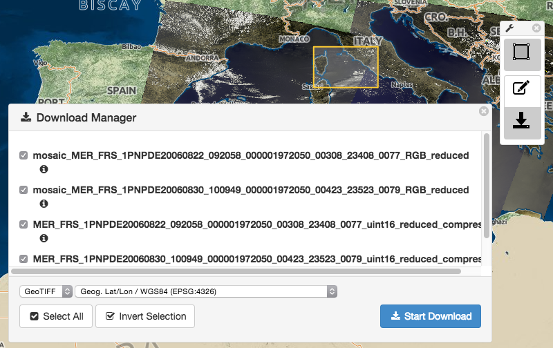

.. Webclient Interface
  #-----------------------------------------------------------------------------
  # $Id$
  #
  # Project: EOxServer <http://eoxserver.org>
  # Authors: Stephan Krause <stephan.krause@eox.at>
  #          Stephan Meissl <stephan.meissl@eox.at>
  #          Fabian Schindler <fabian.schindler@eox.at>
  #
  #-----------------------------------------------------------------------------
  # Copyright (C) 2011 EOX IT Services GmbH
  #
  # Permission is hereby granted, free of charge, to any person obtaining a copy
  # of this software and associated documentation files (the "Software"), to
  # deal in the Software without restriction, including without limitation the
  # rights to use, copy, modify, merge, publish, distribute, sublicense, and/or
  # sell copies of the Software, and to permit persons to whom the Software is
  # furnished to do so, subject to the following conditions:
  #
  # The above copyright notice and this permission notice shall be included in
  # all copies of this Software or works derived from this Software.
  #
  # THE SOFTWARE IS PROVIDED "AS IS", WITHOUT WARRANTY OF ANY KIND, EXPRESS OR
  # IMPLIED, INCLUDING BUT NOT LIMITED TO THE WARRANTIES OF MERCHANTABILITY,
  # FITNESS FOR A PARTICULAR PURPOSE AND NONINFRINGEMENT. IN NO EVENT SHALL THE
  # AUTHORS OR COPYRIGHT HOLDERS BE LIABLE FOR ANY CLAIM, DAMAGES OR OTHER
  # LIABILITY, WHETHER IN AN ACTION OF CONTRACT, TORT OR OTHERWISE, ARISING
  # FROM, OUT OF OR IN CONNECTION WITH THE SOFTWARE OR THE USE OR OTHER DEALINGS
  # IN THE SOFTWARE.
  #-----------------------------------------------------------------------------

.. _webclient:

The Webclient Interface
=======================

.. contents:: Table of Contents
    :depth: 3
    :backlinks: top

The webclient interface is an application running in the browser and provides a
preview of all Datasets in a specified Dataset Series. It uses an
`OpenLayers <http://openlayers.org/>`_ display to show a WMS view of the
datasets within a map context. The background map tiles are provided by
`EOX <https://maps.eox.at//>`_.

It can further be used to provide a download mechanism for registered datasets.

Enable the Webclient Interface
------------------------------

To enable the webclient interface, several adjustments have to be made to the
instances ``settings.py`` and ``urls.py``.

First off, the ``eoxserver.webclient`` has to be inserted in the ``INSTALLED_APPS``
option of your ``settings.py``. As the interface also requires several static
files like style-sheets and script files, the option ``STATIC_URL`` has to be set
to a path the webserver is able to serve, for example ``/static/``. The static
media files are located under ``path/to/eoxserver/webclient/static`` and can be
collected via the `collectstatic command
<https://docs.djangoproject.com/en/1.8/ref/contrib/staticfiles/#collectstatic>`_.

To finally enable the webclient, a proper URL scheme has to be set up in
``urls.py``. The following lines would enable the index and the webclient view
on the URL ``www.yourdomain.com/client``.
::

    urlpatterns = patterns('',
        ...
        url(r'^client/', include("eoxserver.webclient.urls")),
        ...
    )

Using the webclient interface
-----------------------------

The webclient interface can be accessed via the given URL in `urls.py` as
described in the instructions above, whereas the URL `www.yourdomain.com/client` would
open an index view, displaying links to the webclient for every dataset series
registered in the system. To view the webclient for a specific dataset series,
use this URL: `www.yourdomain.com/client/<EOID>` where `<EOID>` is the EO-ID of
the dataset series you want to inspect.

.. _fig_webclient_autotest:
.. figure:: images/webclient_autotest.png
   :align: center

   *The webclient showing the contents of the autotest instance.*

The map can be panned with via mouse dragging or the map-moving buttons in the
upper left of the screen. Alternatively, the arrow keys can be used. The
zoomlevel can be adjusted with the mouse scrolling wheel or the zoom-level
buttons located directly below the pan control buttons.

A click on the small "+" sign on the upper right of the screen reveals the
layer switcher control, where the preview and outline layers of the dataset
series can be switched on or off.

The upper menu allows to switch the visibility of the "Layers", "Tools" and
"About" panels. The "Layers" panel allows to set the visibility of all the
enabled layers of the instance. This includes all non-empty collections and all
coverages that are ``visible`` but not in a collection. Also the background and
the overlay can be altered.

The "Tools" panel allows to draw bounding boxes, manage selections and trigger
the download. In order to download, first at least one bounding box must be
drawn. Afterwards the download icon is clickable.

.. _fig_webclient_autotest_download_view:

   *The download selection view.*

Upon clicking on the download icon, the download view is shown. It displays all
the coverages available for download that are in the active layers and are
intersecting with the spatio-temporal subsets. There, additional download
options can be made:

  * actually selecting coverages for download
  * selecting an output format
  * selecting an output projection

When all coverages to be downloaded are selected and all configuration is done
a click on "Start Download" triggers the download of each coverage, subcetted by
the given spatial subsets.

The "About" panel shows general info of `EOxClient
<https://github.com/EOX-A/EOxClient>`_, the software used to build the
webclient.

In the bottom there is the timeslider widget. It is only shown if at least one
layer is active. Like the map, it is "zoomable" (use the mousewheel when the
mouse is over the timeslider) and "pannable" (the bar that contains the actual
dates and times is the handle). It also allows to draw time intervals by
dragging over the upper half of the widget. The upper half is also where
coverages are displayed as colored dots or lines. The color of the dots/lines is
the same as the color of its associated collection, whereas only active
collections are visible on the timeslider. Hollow dots/lines mean that
the coverage is currently not in the maps viewport. By clicking on a dot/line
the map zooms to the coverages extent.
